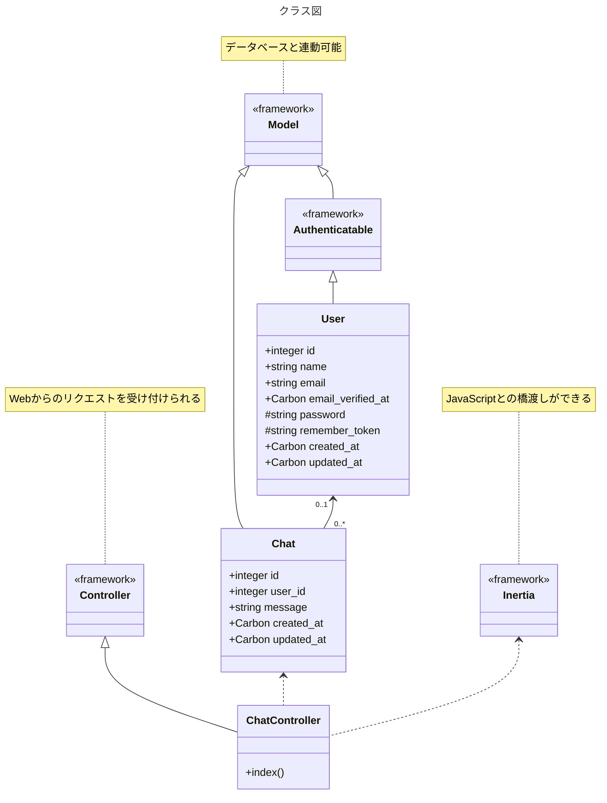
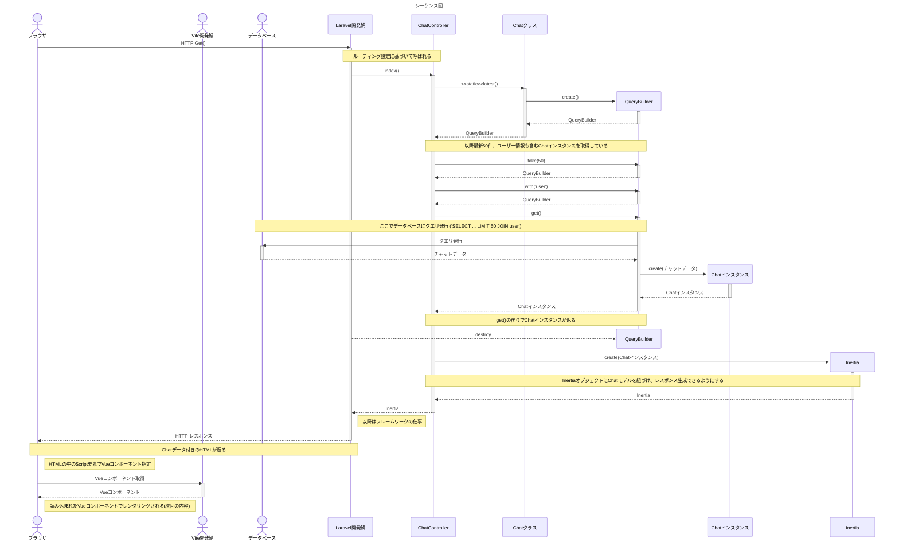

@[card](https://zenn.dev/dameyodamedame/articles/a5a281b10e96e3)

上記の記事の詳細記事です。
前回の記事は以下になります。

@[card](https://zenn.dev/dameyodamedame/articles/f604e345e8163f)

今回の記事はこの記事の続きです。

# この記事でのゴールとより詳細な仕様

- 初期表示のみ
- メッセージ送信なし
- オンライン人数表示なし
- データベース内のメッセージを50件まで表示
- ユーザーや認証/設定はLaravelのデフォルトを使用
- 認証されてる場合はユーザー名/されてない場合は匿名で表示
- デフォルトでユーザー設定にあるダークモードとライトモードの両方で表示できる
- phpでリクエストを受け付け、レスポンスをinertiaに委譲するまで(php部分のみ)

# 設計

今回は前回作ったモデルをWebブラウザで表示できるよう、PHP部分を作ります。

## LaravelでWebリクエストにレスポンスを返す方法

LaravelもPHPなので、printfやらechoやらしてしまえばどこでもそのままHTMLを返せるのですが、普通はLaravelの作法に則ってHTMLを返します。Laravelの昔ながらの標準的な方法は以下になります。

- Bladeテンプレートを使ってPHPでHTMLを生成して返す

今回はLaravelのStarter Kitsを使い、標準認証＋Vueを選択して作成したプロジェクトなので、以下の方法もあります。

- Inertia.jsを使ってVueのコンポーネントを指定し、それが表示されるようなHTMLを生成して返す

Vueを使ったリアクティブなページにするなら、原則後者にした方が楽なので、今回は後者の方法を選択します。

## クラス図

クラス図的にはこんな感じになります。



※`<<framework>>`と付いているクラスはLaravel側で用意されているクラスです。

今回のミッションは主に`ChatController` クラスを作成し、`index()`メソッドの中を実装することです。このメソッドの中では、前回作成した`Chat`クラスを使ってデータベース上のデータを取得し、InertiaにVue側で必要なデータを渡しつつレスポンスを作ってもらいます。

Vue側に渡すデータはDBから取得した最新最大50件分のチャットデータです。

## シーケンス図

動きを[シーケンス図](https://ja.wikipedia.org/wiki/%E3%82%B7%E3%83%BC%E3%82%B1%E3%83%B3%E3%82%B9%E5%9B%B3)で説明すると以下のようになります。



なお、Laravel開発鯖(artisan)と[Vite](https://ja.wikipedia.org/wiki/Vite)開発鯖(node.js)は、今回のプロジェクトだと本番環境では1つのWeb鯖(nginx+php-fpmなど)に集約されます。

# 実装

それでは実装の変更部分です。前回に引き続き、テストコードを含めGemini2.5 flashが吐いたコードをベースにしています。

[diff形式の差分表記](https://www.gnu.org/software/diffutils/manual/html_node/Detailed-Unified.html)になっているのでご注意ください。行頭が`+`の行が追加行で、行頭が`-`の行が削除行になります。

## ルーティング

本家のドキュメントでは以下のように説明されています。

@[card](https://laravel.com/docs/12.x/routing)

```diff php:routes/web.php
@@ -2,6 +2,7 @@

 use Illuminate\Support\Facades\Route;
 use Inertia\Inertia;
+use App\Http\Controllers\ChatController;

 Route::get('/', function () {
     return Inertia::render('Welcome');
@@ -11,5 +12,7 @@
     return Inertia::render('Dashboard');
 })->middleware(['auth', 'verified'])->name('dashboard');

+Route::get('chat', [ChatController::class, 'index'])->name('chat');
+
 require __DIR__.'/settings.php';
 require __DIR__.'/auth.php';
```

## Controller

本家のドキュメントでは以下のように説明されています。

@[card](https://laravel.com/docs/12.x/controllers)

```diff php: app/Http/Controllers/ChatController.php
@@ -5,6 +5,10 @@
 use App\Http\Requests\StoreChatRequest;
 use App\Http\Requests\UpdateChatRequest;
 use App\Models\Chat;
+use App\Models\User;
+use Illuminate\Support\Facades\Auth;
+use Illuminate\Support\Facades\Log;
+use Inertia\Inertia;

 class ChatController extends Controller
 {
@@ -13,7 +17,10 @@ class ChatController extends Controller
      */
     public function index()
     {
-        //
+        $initialMessages = Chat::latest()->take(50)->with('user')->get();
+        return Inertia::render('Chat/Index', [
+            'initialMessages' => $initialMessages,
+        ]);
     }

     /**
```

これだけで初期表示に関係するphp部分の実装は終わりです。

## この実装で動かすとどうなるか

先に図示したシーケンス図のVueコンポーネントがありません。この状態で動かしたらエラーになってほしいところですが、どうなるのかを見てみましょう。

```shell-session
~/php/example-app $ composer run dev
```

そしてブラウザから http://localhost:8000/chat を見てみます。


残念ながら真っ白な画面になります。`composer run dev`したコンソールにも何も表示されません。

何が起きているのかというと、**ブラウザの中で動作しているJavaScript部分でエラーが起きている**のです(正確にはJavaScriptの読み込み部分)。しかし**Android単体ではブラウザに開発者ツールが付いていない**ため、エラーを見ることができません。

一応先ほどの[シーケンス図](#シーケンス図)の最後で描かれているように、Vueのコンポーネントを読み込む際に未作成ゆえエラーが起きるのは予測できます。

Android単体でブラウザではなく鯖側の動作から確認する方法は、実際にCLIからHTTPでアクセスしてHTMLの中身がどうなっているのかを見ることだけです。以下で見てみます。

```shell-session
~/php/example-app $ curl 'http://localhost:8000/chat'
...
...<script type="module" src="http://127.0.0.1:5173/resources/js/pages/Chat/Index.vue"></script>...
```

長々と続くHTMLの中に上のような記述が見つかります(事前に予測できないと見つけるのは困難です)。そしてこれを読み込む際にエラーが起きているということです(ポート5173でlistenしているのはvite鯖です)。実際にHTTPでアクセスしてみます。

```shell-session
~/php/example-app $ curl -i 'http://127.0.0.1:5173/resources/js/pages/Chat/Index.vue'
HTTP/1.1 404 Not Found
Vary: Origin
...
```

`-i`オプションでヘッダーなどを表示させてHTTPのレスポンスステータスを見ていますが、`404 Not Found`が返っているのが分かります。これで確認完了です。

本節ではAndroid単体での話しかしませんが、他にPCを持っている/借りられる場合の確認手段を記事の末尾で紹介しておきます。該当する人はそちらも合わせて読んでみてください。無理なくエラーを見ることが出来ます。

## ダミーのVueコンポーネント(ページ)

本物は次回に作るので説明しませんが、エラーを目視できない上に真っ白では寂しいので、少しだけ記述しておきます。

```vue:resources/js/pages/Chat/Index.vue
<script setup lang="ts">
defineProps({initialMessages: Object});
</script>
<template>{{initialMessages}}</template>
```

渡したChatオブジェクトをそのまま画面にテキスト表示するだけのコードです。
ブラウザから http://localhost:8000/chat を見てみると…


- 画面が何かしら表示されること
- 期待したデータらしきものが渡っていること

が確認できました。今回分の実装は完了でいいでしょう。

# テスト

今回多少ロジックがあるのはController部分です。ここを中心にテストコードを書いておきます。
分類としては[Featureテスト](https://laravel.com/docs/12.x/testing#introduction)で[HTTPテスト](https://laravel.com/docs/12.x/http-tests)に該当します。

## Controller

まずはテストコードの雛形を作ります。

```shell-session
~/php/example-app $ php artisan make:test ChatControllerTest
```

テストケースを考えて、必要なコードを埋めていきます。

```php:tests/Feature/ChatControllerTest.php
<?php

namespace Tests\Feature;

use Illuminate\Foundation\Testing\RefreshDatabase;
use Illuminate\Foundation\Testing\WithFaker;
use Tests\TestCase;
use App\Models\Chat;
use App\Models\User;
use Inertia\Testing\AssertableInertia as Assert;
use Illuminate\Support\Facades\Config; // バグ回避用

class ChatControllerTest extends TestCase
{
    use RefreshDatabase; // テストごとにデータベースをリフレッシュ

    /**
     * 各テストメソッドの前に実行されるセットアップ
     *
     * @return void
     */
    protected function setUp(): void
    {
        parent::setUp();

        // Inertiaテストヘルパーがコンポーネントを探すパスを明示的に設定
        // 多分InertiaがPages→pagesにしたのをStarterkitsが追いきれていないバグ
        // reactは修正されてる
        // https://github.com/laravel/react-starter-kit/pull/66
        // がvueはまだなので今回は回避した
        Config::set('inertia.testing.page_paths', [
            resource_path('js/pages'),
        ]);
    }

    /**
     * チャット一覧画面が正しく表示されることをテスト
     *
     * @return void
     */
    public function test_chat_index_page_can_be_rendered()
    {
        // テストデータとしてユーザーとチャットメッセージを作成
        $user = User::factory()->create();
        Chat::factory()->count(5)->create(['user_id' => $user->id]);

        // 匿名ユーザーとしてチャット一覧ページにアクセス
        // 認証が不要なため、actingAsを使用する必要はありません
        $response = $this->get('/chat');

        // レスポンスが成功したことを確認
        $response->assertStatus(200);

        // Inertiaレスポンスであることを確認し、initialMessagesプロパティが存在することを確認
        $response->assertInertia(fn (Assert $page) => $page
            ->component('Chat/Index') // レンダリングされるInertiaコンポーネントを確認
            ->has('initialMessages', 5) // initialMessagesプロパティが存在し、5つのチャットがあることを確認
            ->has('initialMessages.0', fn (Assert $message) => $message
                ->has('user') // 各メッセージにユーザー情報が含まれていることを確認
                ->etc() // その他のプロパティを気にしない場合
            )
        );
    }

    /**
     * 最新の50件のチャットメッセージが取得されることをテスト
     *
     * @return void
     */
    public function test_chat_index_loads_latest_50_messages()
    {
        $user = User::factory()->create();

        // 55件のチャットメッセージを作成し、50件より多いことを確認
        Chat::factory()->count(55)->create(['user_id' => $user->id]);

        $response = $this->get('/chat');

        $response->assertStatus(200);

        // initialMessagesプロパティに50件のメッセージが含まれていることを確認
        $response->assertInertia(fn (Assert $page) => $page
            ->has('initialMessages', 50)
        );

        // 取得されたメッセージが最新の50件であることを確認するため、
        // 最初のメッセージが作成された日時より後のメッセージが取得されていることを確認することもできます。
        // （ここではシンプルに件数のみ確認）
    }

    /**
     * メッセージにユーザー情報が含まれていることをテスト
     *
     * @return void
     */
    public function test_chat_messages_include_user_information()
    {
        $user = User::factory()->create([
            'name' => 'Test User',
            'email' => 'test@example.com',
        ]);
        Chat::factory()->create(['user_id' => $user->id, 'message' => 'Hello World']);

        $response = $this->get('/chat');

        $response->assertStatus(200);

        $response->assertInertia(fn (Assert $page) => $page
            ->component('Chat/Index')
            ->has('initialMessages.0', fn (Assert $message) => $message
                ->where('message', 'Hello World')
                ->has('user', fn (Assert $userAssert) => $userAssert
                    ->where('name', 'Test User')
                    ->where('email', 'test@example.com')
                    ->etc()
                )
                ->etc()
            )
        );
    }
}
```

最初の`setup()`メソッドは理解しなくていいです。Starter Kitsのバグなので。
他はGeminiが吐いたコメントを元に把握してください。名前はコントローラになっていますが、ルーティング部分もデータベース部分も含めた機能テストになっています。

なお本家のドキュメントは以下のとおり。

@[card](https://inertiajs.com/testing)

# 補足

先述したPCを使った確認方法についてです。

## 自分のPCである場合

借り物でなければAndroid SDK(adbが必要)を入れてUSBで繋ぐことでPC上のchromeからスマホのchromeを対象に開発者ツールを使うことができます。

https://developer.chrome.com/docs/devtools/remote-debugging?hl=ja

詳細はデバイスごとに違う可能性があるのでここでは説明しません。

正しく接続できると、PC上のchromeで以下のような画面を見ることができます。


実際にAndroid上で動いているブラウザをリモート操作しているだけなので、この方法が一番正当な方法です。

## 借り物のPCである場合

恐らくインストールしたりが出来ないので、上の方法は使えません。

なので、スマホ上のLaravel鯖とvite鯖にPC側からアクセスできるように設定してみます。

**Laravel側の設定**

composerの機能で[スクリプト実行](https://getcomposer.org/doc/articles/scripts.md#defining-scripts)されている部分を書き換えます。なお、スマホのIPアドレスを直に入れているので、**恒久的には使用できません**。

```diff json:composer.json
@@ -54,7 +54,7 @@
         ],
         "dev": [
             "Composer\\Config::disableProcessTimeout",
-            "npx concurrently -c \"#93c5fd,#c4b5fd,#fb7185,#fdba74\" \"php artisan serve\" \"php artisan queue:listen --tries=1\" \"php artisan pail --timeout=0\" \"npm run dev\" --names=server,queue,logs,vite"
+            "npx concurrently -c \"#93c5fd,#c4b5fd,#fb7185,#fdba74\" \"php artisan serve --host=0.0.0.0\" \"php artisan queue:listen --tries=1\" \"php artisan pail --timeout=0\" \"npm run dev\" --names=server,queue,logs,vite"
         ],
         "dev:ssr": [
             "npm run build:ssr",
```

`composer run dev`したときLaravel鯖(artisan)は元々localhostでlistenする設定ですが、'0.0.0.0'として、全ネットワークインターフェースでlistenする設定に変更しています。このオプションはドキュメントに記載がありませんが、`php artisan serve --help`とした際に表示される情報を根拠にしています。

**Vite側の設定**

`composer run dev`する際にバックグラウンドで`npm run dev`が実行され、vite鯖が立ち上がっています。この鯖の設定ファイルを変更します。

```diff ts:vite.config.ts
@@ -28,4 +28,12 @@ export default defineConfig({
             'ziggy-js': resolve(__dirname, 'vendor/tightenco/ziggy'),
         },
     },
+    server: {
+        host: true,
+        port: 5173,
+        origin: 'http://スマホのIPアドレス:5173',
+        cors: {
+            origin: '*',
+        },
+    }
 });
```

[server.host](https://ja.vite.dev/config/server-options.html#server-host)で`0.0.0.0`でのlistenを行う設定にしています。
[server.origin](https://ja.vite.dev/config/server-options.html#server-origin)でInertia(PHP側)が生成するVite鯖のURLが変わります。
[server.cors.origin](https://ja.vite.dev/config/server-options.html#server-cors)で、corsの制約が外れます。

PCのブラウザから http://スマホのIPアドレス:8000/chat を開けば以下の画面を見ることができます。


フォントなどは違いますが、画面サイズなどをスマホに合わせたりも出来るので、ある程度は確認できます。


一応これでPCの助けを借りれば何とかエラーを直接確認できることが説明出来ました。妙な現象に悩まされたときは、JavaScript部分のステップ実行なども出来るので、無理せずPCを借りた方が早いです。
