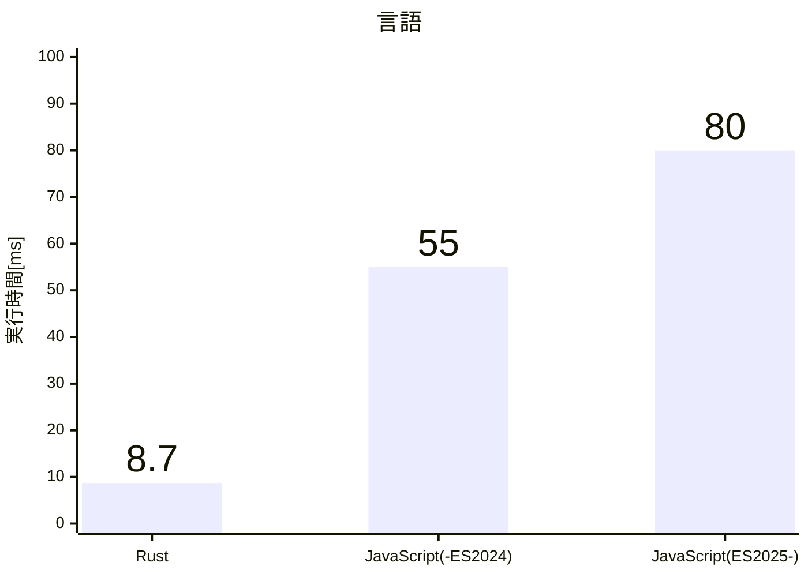
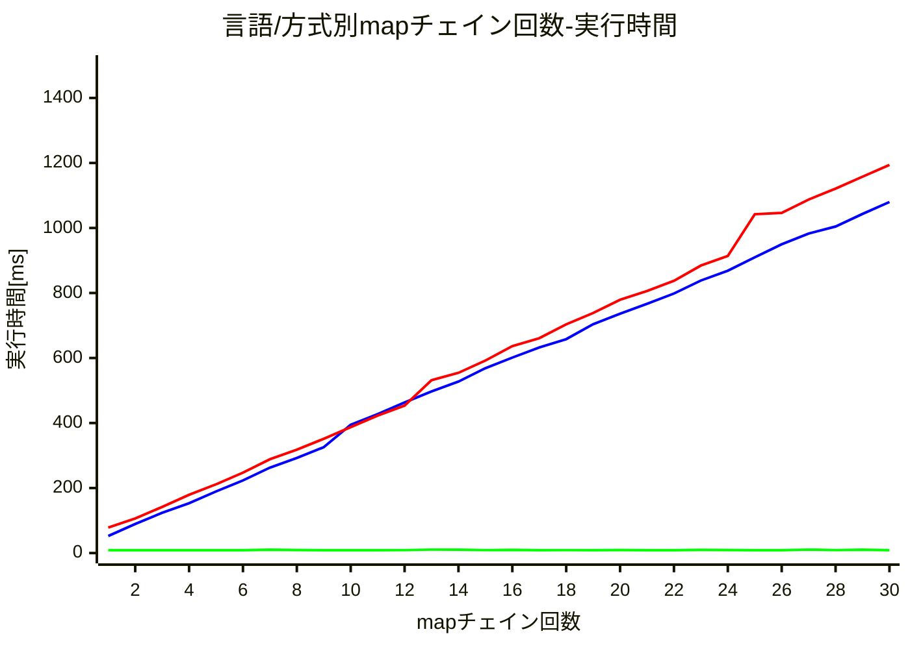
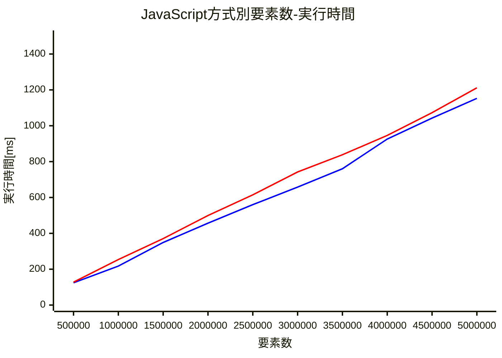
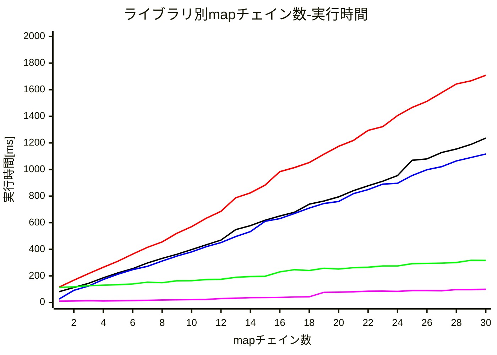
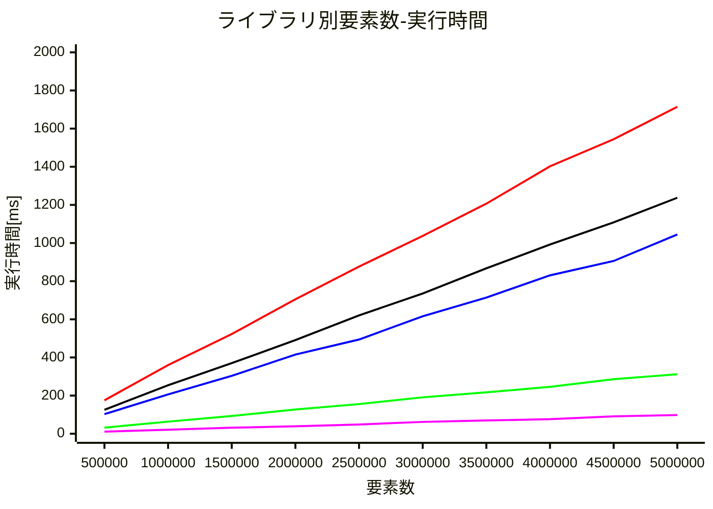

# 序

[以前Qiitaにあげていた記事](https://github.com/marudedameo2019/qiita_old_articles/blob/main/a0fc96d3e43726012d0f.md)の更新版です(Iterator Helpersが標準入りし、メンテナンス期間のnode.js LTSで使えるようになったので)。

RustとJavaScriptで似たような書き方のメソッドチェインを比較します。

## Rust

https://github.com/marudedameo2019/lazy-stream-examples/blob/main/lazy_stream.rs

コンパイルと出力はこんな感じになります。

```sh
$ rustc -g lazy_stream.rs
$ ./lazy_stream
map: 0
for_each: 0
map: 1
for_each: 1
map: 2
for_each: 2
```

## JavaScript(～ES2024)

JavaScriptでよく見るのはこちらです。

https://github.com/marudedameo2019/lazy-stream-examples/blob/main/eager_stream.mjs

出力はこんな感じになります。

```sh
$ node eager_stream.mjs
map: 0
map: 1
map: 2
for_each: 0
for_each: 1
for_each: 2
```

## 違い

Rustは最初の要素に対して`map`->`for_each`が順番に処理されていきましたが、JavaScript(～ES2024)では一旦`map`が全要素処理してから`forEach`の処理が動いています。JavaScript(～ES2024)は`map`の結果を一旦全部どこかに保存しないと`for_each`を動かせないということになります。対してRustは処理中は1つの要素の値だけしか覚えてなくていいので、途中経過の保存とか考える必要がありません。

つまりRustのメソッドチェインの方がはるかに効率良く処理できるということです。

## JavaScript(ES2025～)^[node.js v22以降]

今までは前節のような形だったJavaScriptですが、最近標準入りした[Iterator Helpers](https://developer.mozilla.org/ja/docs/Web/JavaScript/Reference/Global_Objects/Iterator#%E3%82%A4%E3%83%86%E3%83%AC%E3%83%BC%E3%82%BF%E3%83%BC%E3%83%98%E3%83%AB%E3%83%91%E3%83%BC%E3%83%A1%E3%82%BD%E3%83%83%E3%83%89)により、今までは`Array`など一部のオブジェクトしか使えなかった`map()`などが`Iterator`から使えるようになりました。

https://github.com/marudedameo2019/lazy-stream-examples/blob/main/lazy_stream.mjs

出力はこんな感じになります。

```sh
$ node lazy_stream.mjs
map: 0
for_each: 0
map: 1
for_each: 1
map: 2
for_each: 2
```

コード上は`v`が`v.values()`になっただけです。この`values()`の戻り値が`iterator`オブジェクトになっています。この`iterator`に`map()`を使うと、Rustと同じ順番で処理される、ということです。

# 1. 最初のベンチマーク

さて、さっきのようなコードがそれぞれどのくらいの時間になるのでしょう？
マイクロベンチマーク用のライブラリなどは使用しないので、少し大きめ、5,000,000個の配列を使って1回だけ計測してみます。

## 1-1. Rust

https://github.com/marudedameo2019/lazy-stream-examples/blob/main/lazy_stream_measure.rs

実行すると…

```sh
$ rustc -g -O lazy_stream_measure.rs
$ ./lazy_stream_measure
8.7455ms
```

## 1-2. JavaScript(Arrayからchain)

ES2024までと書いてきた方式です。実際にはArrayに対するメソッドをチェインする形になります。

https://github.com/marudedameo2019/lazy-stream-examples/blob/main/eager_stream_measure.mjs

実行すると…

```sh
$ node eager_stream_measure.mjs
54.9247[ms]
```

## 1-3. JavaScript(Iteratorからchain)

ES2025以降と書いてきた方式です。実際にはIteratorに対するメソッドをチェインする形になります。

https://github.com/marudedameo2019/lazy-stream-examples/blob/main/lazy_stream_measure.mjs

実行すると…

```sh
$ node lazy_stream_measure.mjs
79.8812[ms]
```

## 1-4. 結果と考察

|言語|評価タイミング|走査方式|実行時間[ms]|
|:--:|:--:|:--:|--:|
|Rust|遅延|パイプライン|8.7|
|JavaScript(-ES2024)|即時|単一Array|55|
|JavaScript(ES2025-)|遅延|パイプライン|80|



あれ？JavaScriptはRustと同じ方法(遅延評価-パイプライン方式)にしても遅くなりましたね…
なぜ途中経過の保存が不要な方法でこんなに遅いんでしょう？
同じ計算で500万個ものデータを余計に作った方が速いのは理不尽です。

次節以降では、パラメータを変えて時間計測し、特性を見ていきます。

# 2. mapのチェイン数を軸に比較

まずはmapのチェイン数をパラメータとして1～30回に変動させ、結果をグラフにして見てみます。
あと念のため、今回から`map()`の呼び出し関数を同一値ではなく1プラスした値にします。

## 2-1. Rust

https://github.com/marudedameo2019/lazy-stream-examples/blob/main/rust_lazy_map_chain_bench.sh

実際にチェインする部分をinline展開しやすいベタ書きで記述するために、shellスクリプトでRustソースコードを生成して、コンパイル/実行しています。
実行すると…

```sh
$ sh rust_lazy_map_chain_bench.sh
1: 8.9611ms
2: 8.8839ms
3: 8.9186ms
4: 8.8822ms
5: 8.7326ms
6: 8.6581ms
7: 10.3331ms
8: 9.2768ms
9: 8.8803ms
10: 8.7222ms
11: 8.8066ms
12: 9.0208ms
13: 10.4953ms
14: 10.1801ms
15: 8.9894ms
16: 9.8573ms
17: 8.6835ms
18: 9.0242ms
19: 8.8442ms
20: 9.0932ms
21: 8.827ms
22: 8.886ms
23: 9.9088ms
24: 9.2014ms
25: 8.7764ms
26: 8.8036ms
27: 10.5373ms
28: 8.9968ms
29: 10.1058ms
30: 8.9222ms
```

## 2-2. JavaScript(Arrayからchain)

https://github.com/marudedameo2019/lazy-stream-examples/blob/main/js_eager_map_chain_bench.sh

実際にチェインする部分を最適化しやすいベタ書きで記述するために、shellスクリプトでJavaScriptソースコードを生成して、コンパイル/実行しています。
実行すると…

```sh
$ sh js_eager_map_chain_bench.sh
1: 52.3673ms
2: 89.38060000000002ms
3: 123.78190000000001ms
4: 153.17379999999997ms
5: 189.41179999999997ms
6: 223.33410000000003ms
7: 262.7211ms
8: 292.5323999999998ms
9: 325.6000999999999ms
10: 394.8126000000002ms
11: 427.47810000000027ms
12: 463.21839999999975ms
13: 497.3040000000001ms
14: 527.4676ms
15: 568.6698000000006ms
16: 601.1943999999994ms
17: 632.3638999999994ms
18: 657.9794000000002ms
19: 703.9106999999995ms
20: 736.3688000000011ms
21: 766.6987000000008ms
22: 798.2955999999995ms
23: 838.3439999999991ms
24: 868.5851000000002ms
25: 909.8701000000001ms
26: 949.7680999999993ms
27: 982.7556999999997ms
28: 1004.4650999999976ms
29: 1043.1407ms
30: 1079.8250000000007ms
```

## 2-3. JavaScript(Iteratorからchain)

https://github.com/marudedameo2019/lazy-stream-examples/blob/main/js_lazy_map_chain_bench.sh

Arrayからchainする場合と同様です。
実行すると…

```sh
$ sh js_lazy_map_chain_bench.sh
1: 78.26529999999998ms
2: 106.4058ms
3: 141.8759ms
4: 179.3179ms
5: 211.36840000000007ms
6: 247.45170000000007ms
7: 288.39480000000003ms
8: 317.8427999999999ms
9: 351.5341999999998ms
10: 387.3402000000001ms
11: 422.8483000000001ms
12: 453.58719999999994ms
13: 531.6698999999999ms
14: 554.3515000000002ms
15: 592.0908000000009ms
16: 636.6707999999999ms
17: 661.0563000000002ms
18: 703.4830000000002ms
19: 738.3752999999997ms
20: 779.1808000000001ms
21: 806.3011000000006ms
22: 837.5810999999994ms
23: 884.4017000000003ms
24: 914.1394999999993ms
25: 1042.2261999999992ms
26: 1046.4145000000008ms
27: 1087.3889ms
28: 1121.0845999999983ms
29: 1157.8807000000015ms
30: 1193.8264999999992ms
```

## 2-4. 結果と考察



**緑: Rust/青: JavaScript(Array)/赤: JavaScript(Iterator)**

Rustは単純な処理だとしっかり最適化されてるので、`map()`のチェイン回数が増えてもほぼ影響がなく圧倒的に速いです。言語別ではもう比較になりませんね。

JavaScriptはArrayもIteratorも単調増加で、特にどこかで逆転するような傾向もなく、若干Array側が速いか、という程度の結果になっています。
チェイン回数が増えるほど途中経過の生成コストの差が表れるかと思いましたが、そうでもないようです。
ただ、即時評価のArray側はメモリをモリモリ使うので、gcの頻度は上がるでしょう。
今回は、測定のブレを抑えるために各測定開始直前にgcを挟んでおり、**計測中にgcがほぼ起こりません**(gcを外すと測定のブレが実際に現れます)。

# 3. データ要素数を軸に比較

前節ではチェイン数を増やしたときの、言語別、方式別の処理速度を見てみました。この節ではデータ要素数を変動させた際の傾向を見てみます。
なお安定して十分な速度が出ているRustの測定は、もう行いません。

## 3-1. JavaScript(Arrayからchain)

https://github.com/marudedameo2019/lazy-stream-examples/blob/main/js_eager_elemcnt_bench.sh

実行すると…

```sh
$ sh js_eager_elemcnt_bench.sh
500000: 124.0213ms
1000000: 217.4232ms
1500000: 348.94930000000005ms
2000000: 456.8177999999999ms
2500000: 559.9444000000001ms
3000000: 657.9164999999998ms
3500000: 760.1041999999998ms
4000000: 925.8922000000002ms
4500000: 1042.7107999999998ms
5000000: 1152.7857000000004ms
```

## 3-2. JavaScript(Iteratorからchain)

https://github.com/marudedameo2019/lazy-stream-examples/blob/main/js_lazy_elemcnt_bench.sh

Arrayからchainする場合と同様です。
実行すると…

```sh
$ sh js_lazy_elemcnt_bench.sh
500000: 127.80740000000002ms
1000000: 253.92139999999998ms
1500000: 370.75530000000003ms
2000000: 499.37720000000013ms
2500000: 614.8095000000001ms
3000000: 742.1541000000002ms
3500000: 838.2821999999996ms
4000000: 946.2265000000002ms
4500000: 1073.0588000000007ms
5000000: 1211.6143000000002ms
```

## 3-3. 結果と考察


**青: JavaScript(Array)/赤: JavaScript(Iterator)**

データ要素数による傾向も変化がないようです。とにかくArrayの方が僅かに速い…
期待していた変わった特性もないようです。

つまり、遅延評価をしてもIteratorを使用している限り、どうやっても即時評価より速度が上がらなそうだということだけ分かりました。

# 4. 外部ライブラリで遅延ストリーム

次は遅延ストリームを実現している外部ライブラリをいくつか試して、前節同様mapチェイン数と要素数を軸にしたベンチマークを取ってみます。
目的としてはIteratorを使用しない遅延ストリームを見つけ、遅延ストリームが即時ストリームに勝つところを見たいということです。

測定実装は本章の末節で全ライブラリまとめて用意しています。次節以降は各ライブラリの紹介と、遅延ストリームであることを確認するための簡単なコードを載せています。

## 4-1. RxJS

Angularで使用されているので、それなりのユーザー数を誇るリアクティブライブラリです。UIで非同期イベント処理を書くことが主な用途のpush型遅延ストリームなので、今回のような大きなデータをブン回すような処理は苦手という印象を持つ人も多いと思うのですが、ユーザーに揉まれたからか、非同期というハンデをものともしない(?)、実際にはあまり隙がないライブラリのようです。

https://github.com/marudedameo2019/lazy-stream-examples/blob/main/rxjs_example.mjs

本来のイベント処理風の使い方ではないですが、こんな形に書けます。これを実行すると、

```sh
$ node rxjs_example.mjs
map: 1
forEach: 1
map: 2
forEach: 2
map: 3
forEach: 3
```

となり、遅延ストリームであることが分かります。

## 4-2. IxJS

RxJSと同じ作者が作ったpull型遅延ストリームです。イベントではなくコレクションを想定したライブラリであり、同期/非同期双方を扱えるので、今回の要件には適合しそうに見えます。RxJSと似たような名前付けになっていますが、同期側に関数合成の仕組みはありません。

https://github.com/marudedameo2019/lazy-stream-examples/blob/main/ixjs_example.mjs

RxJSとほぼ同じ形に書けます。これを実行すると、

```sh
$ node ixjs_example.mjs
map: 1
forEach: 1
map: 2
forEach: 2
map: 3
forEach: 3
```

となり、遅延ストリームであることが分かります。今回計測したのは同期側のみです。非同期を使うと、Promise塗れになってとんでもない時間がかかるため、測定しませんでした。

## 4-3. lodash

老舗のJavaScriptユーティリティライブラリです。コレクション周りの機能も揃っており、記述を簡潔に行うために昔よく使われていました。名前から遅延評価で有名なlazy.js(しかしlodashの方が総合的には有名)のベンチマークでも比較されていて、結果もそれなりなので試してみた次第です。

https://github.com/marudedameo2019/lazy-stream-examples/blob/main/lodash_example.mjs

他のと違って、最初に4要素あってそれを最後に3要素に削っています。これは、lodashが**遅延しても要素数に変動がないとパイプライン処理をしない**からです。
そしてこれは**仕様ではなく、現実装がそうなってるだけ**^[判定箇所: https://github.com/lodash/lodash/blob/4.17/lodash.js#L1900]です。
確認した特定のバージョンでのみ使える小技ですね。

実行するとこうなります。

```sh
$ node lodash_example.mjs
map1: 1
map2: 1
map1: 2
map2: 2
map1: 3
map2: 3
forEach: 1
forEach: 2
forEach: 3
```

もう一点他と異なるのは、forEachまではパイプライン処理されないということです。forEachの直前でパイプライン処理が切れ、そこで中間データが作成されてしまっています。
もちろん戻り値で返すならそのまま`value()`で返せば中間データが作成されません。しかし例えば出力をストリームに流したい、というときにそのまま流すことが出来ないということです。

## 4-4. 古のforループで固定ロジック

外部ライブラリが不甲斐ないので、mapをC回実行しそれをforEachする固定ロジックを原始的なforループで実装してみました。

https://github.com/marudedameo2019/lazy-stream-examples/blob/main/oldloop_example.mjs

実行するとこんな感じになります。

```sh
$ node oldloop_example.mjs
map1: 1
map2: 1
forEach: 1
map1: 2
map2: 2
forEach: 2
map1: 3
map2: 3
forEach: 3
```

どれだけ速くしてもnativeを使わない限りこれ以上にはならない、という書き方からロジック最適化の余地がどれくらいあるのか？を見るためのものです。

## 4-5. その他のボツライブラリとボツアイデア

- remeda → 関数合成によるパイプライン処理が売りらしかったが、素の動作があまりにも遅かった
- mapだけなら合成と言う名の最適化ができそう^[特に同じ関数の連続とかなら実装を変えてJIT最適化しやすい形に出来そう]なので、関数合成出来るものを探したが、遅延ストリームでは目立った速度効果がなかった^[合成が効くのは段数が減る即時評価だけで、実際に合成することはパイプライン処理そのものだった]

## 4-6. 実装

https://github.com/marudedameo2019/lazy-stream-examples/blob/main/lazy_bench.mjs

https://github.com/marudedameo2019/lazy-stream-examples/blob/main/lazy_bench.sh

## 4-7. 結果と考察

### 4-7-1. mapチェイン数-実行時間



**黒: Iterator/青: RxJS/赤: IxJS/緑: lodash/紫: loop**

予想通り、最も作りが原始的なlodashが外部ライブラリ勢では好成績をおさめています。ただ、要素数増減のためのダミー要素追加と中間データ生成のコストが固定で入るため、チェイン数が少ないところで振るわない結果になっています。固定コストを除いた分で見れば、古いループ実装の倍程度の時間にまで抑えられており、悪くない感じです。とはいえ、**パイプラン処理されるかどうかが実装依存**なので、オススメできるほどではなく、**安心して使用できる高速な遅延ストリーム実装の出現が待たれます**。lodashがパイプライン処理が選択可能なときはユーザー側で選べればまだ良かったのですが…。

### 4-7-2. 要素数-実行時間



**黒: Iterator/青: RxJS/赤: IxJS/緑: lodash/紫: loop**

こちらはより安定した結果に落ち着いています。傾向は同じなので、特に言うことはありません。強いて言えば、実装によりここまでパフォーマンスが違うものなのかというくらいですね。せめてnativeも使えるIterator Helpersはもう少し頑張ってほしかったです。

# 5. まとめ
- Rustの遅延ストリーム操作はJavaScriptとはオーダーから違う速度
- Rustは特に簡単な処理ならチェイン数が増えても最適化によりほぼ速度が落ちなかい
- JavaScriptのArrayメソッドチェインは、パイプライン処理が出来ないのでメモリ効率が悪い
- JavaScriptのIteratorメソッドチェインは、パイプライン処理が出来るがIteratorの走査が遅い
- JavaScriptのメソッドチェインは上記2点によりどちらでも総合的に大きな性能差がなかった
- JavaScriptでも外部ライブラリを使用し、パイプライン処理でIteratorを使わなければ、メモリ効率もパフォーマンスも同時に上げられる可能性がある
