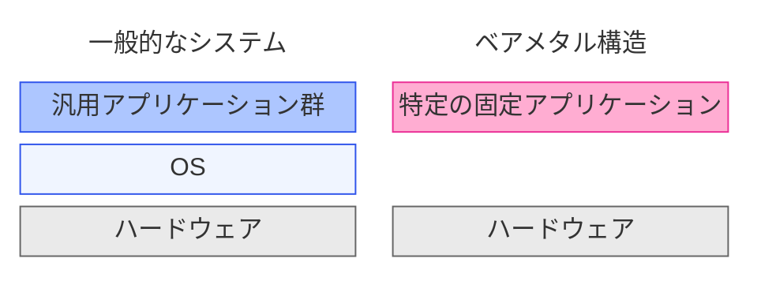
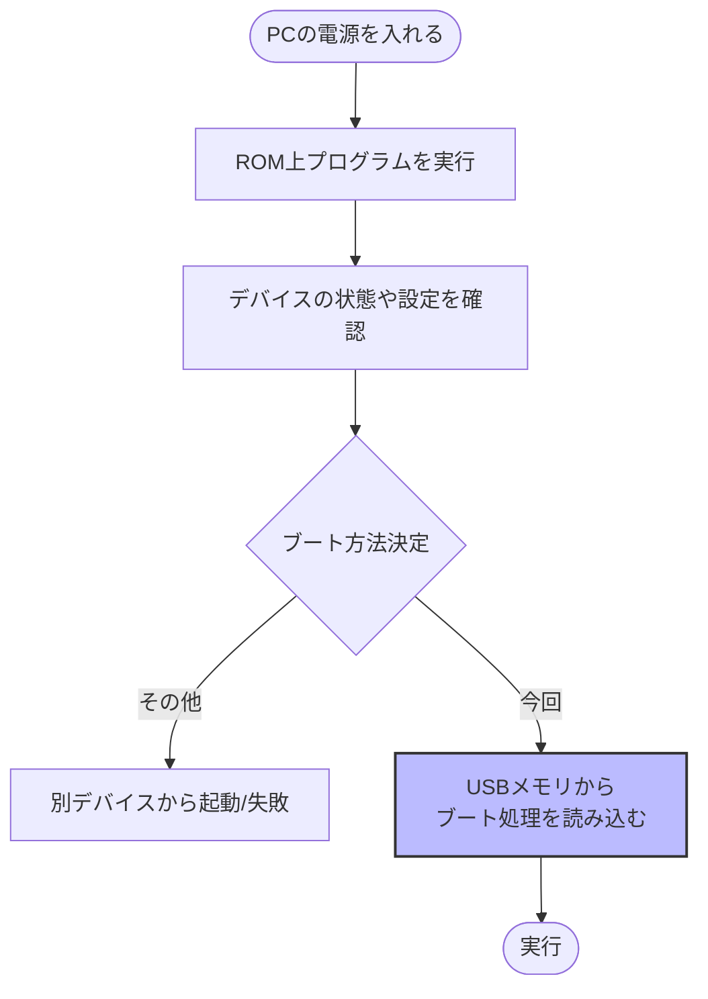
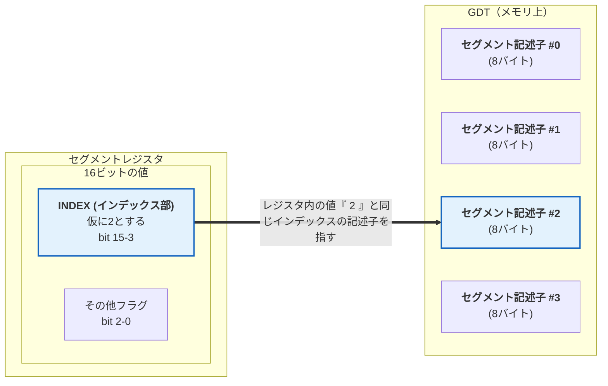
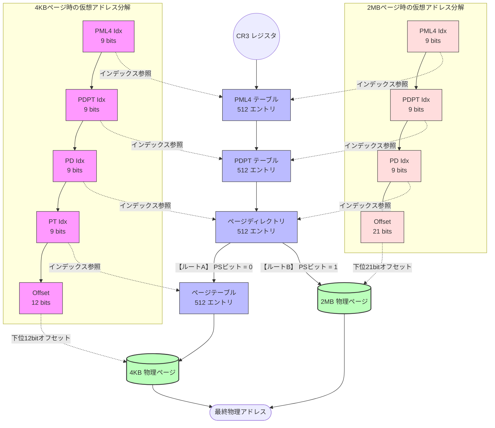

# 序

ベアメタルアプリとは、[OS](https://ja.wikipedia.org/wiki/%E3%82%AA%E3%83%9A%E3%83%AC%E3%83%BC%E3%83%86%E3%82%A3%E3%83%B3%E3%82%B0%E3%82%B7%E3%82%B9%E3%83%86%E3%83%A0)のない環境で動くアプリのことです(通じそうな言葉だけど、ほぼ造語？)。普通のアプリはWindowsなりLinuxなりMacOSなり何かしらのOSの上で動き、実行可能ファイルという形であることが一般的ですが、OSのような共通の基盤を持たず、単一特定のアプリだけが単体で存在するというイメージです。



Raspberry Pi PicoやArduinoなどのマイコン環境を使ったことがある人ならベアメタルアプリをイメージできそうですが、PCしか使ったことない人だとイメージがわかないかもしれません。今回はPC上で動くベアメタルなHello, Worldアプリを作ってみようというお話です。

# 1. 目的

USBメモリからBIOS起動しHello, Worldだけして固まるアプリを作る

# 2. 対象読者

以下の条件を全て満たす方

- Linux上で動作するC/C++アプリケーションを作ったことがある人
- x86_64なアセンブラもある程度知っている人
- USBなどからnativeなLinuxインストーラなどを起動したことがある人

# 3. ベアメタルアプリを作るには…

ベアメタルアプリを作るには、まずOSすら起動していない状態から動作しないといけません。ようはOS起動に必要なものと同じ**ブート処理**を実装しないといけません。本体部分はC++で書くので、C++コードに必要な静的初期化処理なども、必要に応じて書かないといけません(今回はない)。つまり必要なのは、

1. ブート処理(アセンブラ)
1. C/C++の静的初期化処理(今回はない)
1. アプリ本体(C/C++)

の3つです。

# 4. 開発環境の用意

環境はPCなので、Windows上のWSLを想定しています。ディストリビューションとしてはUbuntu 24.04を想定して説明します。VM上のLinuxやnative linuxなどWSL以外を使う場合や、他のディストリビューションの場合は自分で読み替えてください。注意点としてはqemuがGUIを使う点だけですね。spiceで繋いだりも出来ると思うので、頑張れば他のOSにdockerなどでも出来ると思います。

以下はcmd/powershellからwslを起動し、ビルド/デバッグ環境(g++(+binutils)/gdb/qemu)をインストールしてるところです。

```shell-session
> wsl
$ cd
$ sudo apt install -y g++ gdb qemu-system-x86
```

今回アセンブラ部分はGNU asを使うので、nasmとかは不要です。qemuはVM環境での実行、デバッグにgdbも使います。

# 5. ブート処理の系統2種

PCのブート処理の系統は大きく分けて以下の2種類があります。

- [(Legacy) BIOS](https://ja.wikipedia.org/wiki/Basic_Input/Output_System)
- [UEFI](https://ja.wikipedia.org/wiki/Unified_Extensible_Firmware_Interface)

`(Legacy) BIOS`が16bit時代からあった古いやつで、`UEFI`が新しいやつです。最近のPCはUEFIだけしかありませんし、とっても古いPCはBIOSだけしかありません。過渡期のものは大体両方に対応したものになってます(過渡期のものも実際には`UEFI`ですが、[CSM](https://en.wikipedia.org/wiki/UEFI#CSM_booting)を有効に出来、BIOS起動も可能という形です)。ただし過渡期のUEFIは結構不安定で、CSM有効で動かしてる人が多いものもあります。

今回は2系統のうちBIOS起動を選択しているので、**最近のPCでは起動しないものが多いです**。もちろん実機確認できないだけで、最近のPCでもqemuの中なら確実にBIOS起動させられます。BIOS起動を選択しているのは、**単に文字出力が楽だから**です。

# 6. BIOS起動時の動作

## 6-1. 仕様

ベンダ依存している部分が多く、PC共通の網羅的で正式な仕様書はありません。うまくまとめてるのは以下あたりです。

- [Boot Sequence - OSDev Wiki](https://wiki.osdev.org/Boot_Sequence)
- [MBR(x86) - OSDev Wiki](https://wiki.osdev.org/MBR_(x86))

## 6-2. 動作概要

PCは電源を入れるとマザーボードに付いているROMに書かれたプログラムを実行し、そのときのデバイスの状態や設定などにより、どんなブート方法をするのか決めて、決めたところからブート処理をメモリに読み込んで実行します。今回はUSBメモリに目的のブート処理を含むアプリを入れるので、USBメモリからブート処理を読み込む前提になります。



USBメモリはHDDやSSDなどと同様に、ディスクの先頭にMBRと呼ばれる領域を持っています。MBRはディスクの先頭512バイトで、内訳はブート処理(ブートストラップローダ)446バイト(DISK IDに4バイトと予約2バイトを最後に付けて、440バイトの場合もある)とパーティション情報テーブル64バイトとシグニチャ2バイトになります。

BIOSによりMBRが読み込まれるアドレスは固定で0x07c00からです。するとブートローダー部分は0x07c00～0x07dbdに読み込まれることになり、BIOSはMBR読み込み後0x07c00にジャンプすることで、ブート処理に制御を渡します。

## 6-3. ジャンプ直後のCPU状態

BIOSから制御を渡された直後のCPUは、[リアルモード](https://wiki.osdev.org/Real_Mode)で動いています。リアルモードとは16bit CPUである8086と互換性の高い動作状態です。この状態では16bitのセグメントレジスタと16bitのレジスタ(IPなど)を組み合わせた20bit(12bitは重なっていて加算される)のアドレス空間(1MB)にしかアクセスできません。

jmpした直後のレジスタは以下が設定されています。

|レジスタ|設定値|
|:---|:---|
|CS:IP|0x07c00|
|DS:SI|パーティションテーブルの選択エントリ位置|
|DL|起動ドライブ番号|

^[CS:IPの設定方法は加算なので複数ありますが、今回は、セグメントレジスタが0x0000である前提決め打ちで実装しています。0x07c0な機種もあるらしいので、その場合は動作しないかもしれません。もちろん先頭でljmpするなどの回避策も取れますが今回はやってないということです。]

# 7. example1 - リアルモード(16bit)の実装

ある程度分かったと思うので、まずは何か実装してみます。

## 7-1. ゴール

USBメモリからbootし、カーソル位置に「1」という一文字だけ追加表示させ、カーソル位置を次に移動し、そのまま固まる。

## 7-2. 実装

https://github.com/marudedameo2019/baremetalapp4pc_bios/blob/main/example1/boot.s

これが0x07c00から始まるリアルモードの初期化コードです。最初に安全のためcliで外部割り込みをマスクして、それからcs以外のセグメントレジスタを0x0000に初期化しています。esにはパーティションエントリのアドレスの一部が入ってるはずですが、今回は使わないので0x0000で上書き初期化しています。

スタックは割り込みでも使われるので、その後SPを0x7c00に設定しています。上書きしているということはつまり以降retなどでBIOS側には制御が戻らないということです。

その後ろではBIOSの機能をソフトウェア割り込みを使って呼び出しています。ここでは、`1`という文字を1文字だけカーソル位置に出力しています。BIOSの機能は結構沢山あって、主要な機能の一覧は[BIOS - OSDev Wiki](https://wiki.osdev.org/BIOS)にあります。各呼び出しの詳細は[Ralf Brown's Interrupt List - HTML Version](https://www.ctyme.com/rbrown.htm)を見てください。

最後にhltで停止して終わりです。

あと最初の方のおまじないについて少し説明しておくと…

- コンパイルにGNU asを使うので、文法は本来AT&Tが普通ですが、intelを好む人が多いので、ここでは`.intel_syntax`を使っています
- `.code16`はリアルモードのコードであることを伝えています
- `_start`をglobalにしているのは、リンカスクリプトでentryとして伝えているからです

全体でリロケータブルな512バイトのコードが出来上がります。内側にパーティションテーブルなどの領域も含まれていますが、そこは0で埋められてしまいます。

## 7-3. リンカスクリプト

リロケータブルなオブジェクトをセクションごとに結合して、最後にメモリマップに従ったアドレスを割り当てるのがリンカスクリプトです。リンカに渡す設定ファイルのようなものですね。

https://github.com/marudedameo2019/baremetalapp4pc_bios/blob/main/example1/link.ld

## 7-4. ビルド

https://github.com/marudedameo2019/baremetalapp4pc_bios/blob/main/example1/build.sh

## 7-5. QEMUで実行

```shell-session
$ qemu-system-x86_64 -drive format=raw,file=example1.bin
```

example1.binイメージを仮想ディスクとして接続しているx86_64なVMが動いてその画面を表示するwindowが開きます。VMはqemu付属のbiosをROMとして起動し、接続されている仮想ディスクからMBRを読んで、ブート処理を実行し、見事1文字出力して固まります。

## 7-6. QEMUでデバッグ実行

アセンブラを使っていると、すぐに暴走したりリセットが掛かったりして、どこまで動いたのか分からないことが頻繁にあります。そんなときに有効なのがデバッガを使ったソースデバッグです。方法は以下のとおり。

__**7-6-1. QEMUを開始直後で止める**__

```shell-session
$ qemu-system-x86_64 -drive format=raw,file=example1.bin -s -S
```

`-s -S`というオプションが追加されています。`-s`はgdbからremote debug可能にする(portは1234)指定で、`-S`は開始時にfreezeする指定です。

__**7-6-2. gdbでリモート接続する**__

別端末からgdbを起動して接続します。

```shell-session
$ gdb ./example1.elf
...
(gdb) target remote localhost:1234
....
```

あとは普通にブレークポイント設定して続ければ止まります。

```shell-session
(gdb) b _start
Breakpoint 1 at 0x7c00: file boot.s, line 6.
(gdb) c
Continuing.

Breakpoint 1, _start () at boot.s:6
6           cli
(gdb)
```

これ以降は通常のローカル実行と同じ感じで使えますよね。普通にソースラインデバッグできるのですが、リモートだとCPUモード切替が(自動では)うまく扱えず、intなど割り込み時にソースのステップが出来ません。多少不便ですが、ブレークポイントは機能するので、問題があったら`next`せずに`break`を設定して`continue`してください。止める必要がなくなったら`detach`することで切断されます。

## 7-7. USBメモリに焼く

wslからは普通には焼けません(ホストのUSBをWSLに繋ぐ必要がある)。なので私は[MSYS2](https://www.msys2.org/)のddコマンドを使って焼きました。ddコマンドはcygwin派生のアプリなので、

```shell-session
$ cat /proc/partitions
...
    8    17   1005568 sdb1   E:\
...
```

で、デバイスが分かります。この例で`E:`がUSBメモリだとすると、msys2環境でのデバイスは`/dev/sdb1`であるということです。結果この例だとUSBドライブ全体を表すデバイスは`/dev/sdb`だということになります(環境やデバイスなどによって色々変わります)。

wslからビルドした`example1.bin`を例えばMSYS2のユーザーホームである`/mnt/c/msys64/home/[ユーザー名]/`にコピーしたとして、MSYS2を管理者モードで起動してから、

```shell-session
# dd if=./example1.bin of=/dev/(当該デバイス) bs=512 count=1
```

とかすれば書き込めます。よく分からない場合は**絶対にやらないでください**。**環境によって sdb や sdc などは全く異なります**。**間違えるとシステム(HDDやSSD)が吹き飛びます**。

なお、正しく動いてもUSBメモリのパーティションテーブルを破壊するので、MBRフォーマットされているUSBメモリなら、

```shell-session
# dd if=./example1.bin of=/dev/(当該デバイス) bs=446 count=1 conv=notrunc
```

としておくと、446バイト書き込んでそれ以降を壊しません。この方法で書き込む場合、example1なら問題ないのですが、helloでは問題があります。MBRの後ろ512バイト以降にもローダーが存在しているからです。それらも書き込むには、さらに

```shell-session
# dd if=./xxx.bin of=/dev/(当該デバイス) bs=512 count=(必要量) skip=1 seek=1
```

とする必要もあるでしょう。

焼けたら、確認したい実機にUSBメモリを挿して電源を入れ、BIOS管理画面から起動デバイスの優先順位やUEFIならCSMが有効になってるのを確認した後に、動作することを天に祈ってブートするだけです。私の古いPCではこのパーティションすら存在しないUSBメモリでも、運よく`1`を表示してくれました。

# 8. example2 - プロテクトモード(32bit)の実装

次の段階、32bitへ進みます。

## 8-1. ゴール

USBメモリからbootし、プロテクトモードに移行してから、カーソル位置に「2」という一文字だけ追加表示させ、カーソル位置を次に移動し、そのまま固まる。

## 8-2. プロテクトモードとは

通常80386の[プロテクトモード](https://ja.wikipedia.org/wiki/%E3%83%97%E3%83%AD%E3%83%86%E3%82%AF%E3%83%88%E3%83%A2%E3%83%BC%E3%83%89)のことを指します。

- 32bitのアドレス空間(4GB)にフラットにアクセスできる
- リングによる階層型の特権構造を持つ
- ページングによるページ単位(4KB)のアドレスマッピングと保護設定ができる
- セグメントにも保護設定がついた
- タスクによるレジスタ切り替え機能を持つ(あまり利用されない)
- 仮想86モードが使える

## 8-3. リアルモードからプロテクトモードへの移行

移行直後は

- リング0でフル特権
- ページング機能OFF
- タスク機能OFF

なので、やらないといけないのは

- 使い方が変わっているセグメントレジスタへの対処
- そのセグメント内のアドレスへジャンプ

くらいです^[正式にはNMIのマスク(今回やってない)とA20ラインの解放(UEFIのCSMでは不要)も必要です]。これだけでリニアなマッピングのまま4GBアクセス可能になります。

なお**プロテクトモードでINTしてもBIOS機能は呼び出せません**。割り込みベクタの位置や形が全く違うからです。

### 8-3-1. セグメントレジスタとGDT

プロテクトモードに移行すると、セグメントレジスタの扱いが以下のように変わります。

|ビット範囲|フィールド名|正式名称/役割|
|:---:|:---:|:---|
|15 - 3|INDEX|**インデックス部**<br>GDT（またはLDT）内の何番目のセグメント記述子を指すかを指定する値<br>（※下図で「仮に2とする」として解説している部分です）|
|2|TI|**Table Indicator（テーブル指示子）**<br>参照するテーブルを切り替えるフラグ<br>0 = GDT（グローバル記述子テーブル）を参照する<br>1 = LDT（ローカル記述子テーブル）を参照する|
|1 - 0|RPL|**Requested Privilege Level（要求特権レベル）**<br>このセグメントにアクセスしようとしている現在の実行プログラムの特権レベル（0〜3）<br>0 が最高特権（カーネル等）<br>3 が最低特権（アプリ等）<br>を表します|



ここで参照されている[GDT](https://wiki.osdev.org/GDT_Tutorial)というメモリ領域にある各セグメント記述子の中身は以下のとおりです。

|合計ビット幅|ビット範囲|フィールド内位置|フィールド名|役割|
|---:|:---|:---|:---:|:---|
|32|63-56<br>39-32<br>31-16|31-24<br>23-16<br>15-0|ベースアドレス<br>(Base Address)|**セグメントの開始位置**（物理アドレス）<br>メモリ空間上、このセグメントが「どこから始まるか」を指す絶対アドレス|
|20|51-48<br>15-0|19-16<br>15-0|セグメントリミット<br>(Segment Limit)|**セグメントの限界サイズ**<br>このセグメントの大きさが「どこまでか」を指定する値<br>後述するGビット（グラニュラリティ）の設定により、バイト単位（最大1MB）かページ単位（4KB×最大1MB＝4GB）かが変わります|
|1|55||G<br>(Granularity)|0 = Limitが1バイト単位<br>1 = Limitは4KiB単位|
|1|54||D/B|コード用:<br>1＝32ビット<br>0＝16ビットの演算・アドレス指定<br>データ用:<br>1＝スタックポインタにESPを使用<br>0＝SPを使用|
|1|53||L<br>(Long mode)|**ロングモードフラグ**<br>1 = IA-32e（64ビット）モードのコード<br>（プロテクトモードでは通常 0）|
|1|52||Reserved||
|1|47||P<br>(Present)|**セグメント存在フラグ**<br>1 = セグメントがメモリ上に存在<br>0 = 不在（スワップアウト時など）|
|2|46-45||DPL<br>(Descriptor Privilege Level)|**記述子特権レベル**<br>このセグメントにアクセスするために「最低限必要な特権レベル（0〜3）」を定義したもの<br>レジスタ側のRPLなどと比較され、メモリ保護チェックに使われます|
|1|44||S|0 = システム記述子（TSSやLDTなど）<br>1 = コードまたはデータセグメント|
|1|43||E|0=データ<br>1=コード(実行可能)|
|1|42||DC|**データの場合**<br>0=base &lt; offset <br> 1=base &gt; offset（stackなどが該当） <br> **コードの場合** <br> 0:DPLで設定された権限レベル（リング）からのみ実行可能 <br> 1=同等またはより低い権限レベル（リング）から実行可能|
|1|41||RW|**コードの場合**<br>0=読み取り不可<br>1=読み取り可能<br>(書き込みは常に不可)<br>**データの場合**<br>0=書き込み不可<br>1=書き込み可能<br>(読み込みは常に可能)|
|1|40||A|**Accessed**<br>0=ソフトから設定する<br>1=CPUがアクセスされたときに自動で設定する|

今回は全てをリング0の特権モードのまま32bitで動かし、LDTも使わないので、**セグメントレジスタの下位3bitは常に0**です。以上から4GBのアドレス空間を全てアクセス可能とするセグメント記述子は以下になります。

**セグメント記述子#0**(Null)

0固定

**セグメント記述子#1**(コードセグメント用)

|フィールド|値|
|:---:|---:|
|Base Address|0x00000000|
|Segment Limit|0x000FFFFF|
|G|1:4KiB|
|D/B|1:32ビット|
|L|0:プロテクトモード|
|P|1:存在|
|DPL|0|
|S|1:コード/データセグメント|
|E|1:コード|
|DC|0:DPL=CPL|
|RW|1:読み取り可能|
|A|0|

→0x00cf9a000000ffff

**セグメント記述子#2**(コードセグメント以外用)

|フィールド|値|
|:---:|---:|
|Base Address|0x00000000|
|Segment Limit|0x000FFFFF|
|G|1:4KiB|
|D/B|1:ESPを使用|
|L|0:プロテクトモード|
|P|1:存在|
|DPL|0|
|S|1:コード/データセグメント|
|E|0:データ|
|DC|0:DPL=CPL|
|RW|1:書き込み可能|
|A|0|

→0x00cf92000000ffff

## 8-4. 実装

https://github.com/marudedameo2019/baremetalapp4pc_bios/blob/main/example2/boot.s

プロテクトモード移行時、A20有効化処理はUEFI(CSM含む)では不要らしいのですが、純粋なLegacy BIOSでは必要なものも多いらしいので入れています。正式にはNMI禁止も必要らしいのですが、その処理は省略しています。それ以外はGDTRを設定することでGDTを参照できるようにした後、CR0レジスタでプロテクトモードを設定してセグメント指定ジャンプをしてるだけです。

プロテクトモード移行後は、他のセグメントも初期化しています。

その後の処理はポートでカーソル位置、テキストVRAMで文字出力をしています。リアルモードではBIOSが使えましたが、プロテクトモードでは使えないので、自力で実装している感じです。余談ですが、UEFI起動した場合はテキストVRAMを使うモードにできません。これが今回BIOS起動で実装している理由です。

これでアドレス空間は4GBまでアクセスできるようになってるのですが、スタック位置すら変えていないので、実際にはリアルモードと同じ空間(1MB)しか使っていません。これには理由があり、次節以降で説明します。

ビルド以降はほぼ同じなので、説明を省略します。実行すれば「2」という文字が表示されるだけです。

# 9. example3 - ロングモード(64bit)の実装

次の段階、64bitへ進みます。

## 9-1. ゴール

USBメモリからbootし、プロテクトモードを経由しロングモードに移行してから、カーソル位置に「3」という一文字だけ追加表示させ、カーソル位置を次に移動し、そのまま固まる。

## 9-2. ロングモードとは

[ロングモード](https://en.wikipedia.org/wiki/X86-64#Long_mode)とはAMD64の本来の動作モードです。ざっくり言って以下の特徴があります。

- 64bitの仮想アドレス空間(16エクサバイト)にアクセスできる(制限あり)
- ページングが必須になり、セグメントのベース/リミットが無効になった
- 32/16bit互換モードが用意された(互換はプロテクトモード互換という意味。ただし仮想86モードは不可)^[16bit互換モードは16bitプロテクトモード互換であり、仮想86モードもないため、リアルモード用の16bitコードは動かせません]

## 9-3. プロテクトモードからロングモードへの移行

詳細は[Setting Up Long Mode - OSDev Wiki](https://wiki.osdev.org/Setting_Up_Long_Mode)

- 本来は[CPUID](https://wiki.osdev.org/CPUID)のチェックが必要(今回はしていない)
- [ページング](https://wiki.osdev.org/Setting_Up_Paging)の設定(本来は[実メモリの検出](https://wiki.osdev.org/Detecting_Memory_(x86))も必要ですが今回はしてません)
- 64bit用GDT設定
- PAE(32→64bitの過渡期で使われていた4GB→64GB拡張の技術)の有効化
- MSR [EFER](https://wiki.osdev.org/CPU_Registers_x86-64#IA32_EFER)(0xc0000080)のbit8、IA-32e Mode Enableをセット
- CR0のbit8、IA-32e Mode(ロングモード) Enableをセット
- CR3のbit31、Pagingをセットしてページングを有効化
- セグメントジャンプをしてCSを設定→ロングモード移行完了

この中でページングだけは説明が必要です。

### 9-3-1. ページングとは

一般的なページングについては[ページング方式 - Wikipedia](https://ja.wikipedia.org/wiki/%E3%83%9A%E3%83%BC%E3%82%B8%E3%83%B3%E3%82%B0%E6%96%B9%E5%BC%8F)を見てください。ここではx86_64でのページングについて簡単に説明します。

ページングとは、CPUのアドレス指定を仮想アドレスとし、そのアドレスを元にページと呼ばれる単位で物理アドレスを算出する方法です。物理アドレスがない設定にすることも出来ます。ロングモードでのページングは仮想アドレスのbit47から9bit単位で4つ(もしくは3つ)抽出し、4段(もしくは3段)のテーブルを組んで4KiB(もしくは2MiB)のページを特定し、余ったbitをOFFSETとして物理アドレスを決定します^[ここでは初期のロングモードになかった1GiBページを扱いません]。



各テーブルのエントリ(要素)は8バイトで、内訳は以下のとおりになっています。

| ビット範囲 | フラグ / 要素名 | 状態 | 概要・CPUによる用途 |
| :--- | :--- | :--- | :--- |
| **63** | **NX** (No-Execute) | 1 = 実行禁止 | このページにあるコードの実行（実行禁止保護）を不許可にします。 |
| **62 : 52** | Reserved | - | - |
| **51 : 12** | **ベース物理アドレス** | アドレス値 | 次の階層のテーブル、または最終的な物理ページの先頭物理アドレス（40ビット分）を格納します。 |
| **11 : 9** | **AVL** | - | OSが自由に利用できるフラグ枠です。 |
| **8** | **G** (Global) | 1 = 有効 | 1 の場合、CR3（プロセス）が切り替わってもTLB（キャッシュ）から削除されなくなります。 |
| **7** | **PS** (Page Size) | 1 = 特大ページ | 1 の場合、次の階層をスキップして2MBや1GBのページとして扱います（後述）。 |
| **6** | **D** (Dirty) | 1 = 変更あり | このページへの書き込み（データの変更）が発生したときにCPUが自動で 1 にします。 |
| **5** | **A** (Accessed) | 1 = アクセス済 | このページへのアクセス（読み書き）が発生したときにCPUが自動で 1 にします。 |
| **4** | **PCD** | 1 = 禁止 | ページレベルのキャッシュ禁止（Page-level Cache Disable）を制御します. |
| **3** | **PWT** | 1 = 有効 | ライトスルー（Page-level Write-Through）ポリシーを制御します。(キャッシュから実メモリへの遅延書き込みをしないのがライトスルー) |
| **2** | **U / S** (User/Supervisor) | 0 = カーネル<br>1 = ユーザー | メモリの所有権です。0 の場合、リング0以外からアクセスすると保護違反になります。 |
| **1** | **R / W** (Read/Write) | 0 = 読込専用<br>1 = 読書可能 | メモリへの書き込み権限です。0 のページに書き込もうとすると保護違反になります。 |
| **0** | **P** (Present) | 1 = 存在<br>0 = 不在 | **最重要フラグ。** 0 の状態でアクセスすると、OSに**ページフォールト**（割り込み）が発生します。 |

### 9-3-3. 今回目指すページ設定

2MiBを1つだけ用意し、0x00000000001FFFFFまでの仮想アドレス空間を0x00000000001FFFFFまでの物理アドレス空間をリニアに割り当てます。つまり、2MBを越える領域にはアクセスできません。

こうする理由は、実際のメモリは物理アドレス上で飛び飛びに存在しているからです。必ず存在しているのは先頭の1MBだけです。それ以外のメモリの物理アドレスは検出処理が必要で、今回は面倒なので使っていません。

検出処理の詳細は[Detecting Memory (x86) - OSDev Wiki](https://wiki.osdev.org/Detecting_Memory_(x86))を参照してください。

#### PML4テーブル

8バイト x 512個 = 4KiBの領域を0x1000～1FFFに配置します。先頭だけ次のPDPTのテーブルを指すようにし、残りの511個は全て非存在に設定します。

#### PDPT

8バイト x 512個 = 4KiBの領域を1つだけ0x2000～2FFFに用意します。先頭だけ次のPDを指すようにし、残りの511個は全て非存在に設定します。

#### PD

8バイト x 512個 = 4KiBの領域を1つだけ0x3000～3FFFに用意します。先頭だけ0～2MiBの物理アドレスを指し、残りの511個は全て非存在に設定します。

#### PT

4KiBのページがないので作りません。

## 9-4. 実装

https://github.com/marudedameo2019/baremetalapp4pc_bios/blob/main/example3/boot.s

何も難しいことしてない64bitモードへの移行が完了すると、32bitモードと全く同じ要領で'3'を出力して固まります。

# 10. hello - C++との結合

いよいよ64bitのC++を使います。

## 10-1. ゴール

USBメモリからbootし、プロテクトモードを経由しロングモードに移行してmain関数を呼び出し、hello, worldしてそのまま固まる。

## 10-2. 注意点

1. 自分で書いていない関数やクラスは使えない
1. コンストラクタが必要なオブジェクトはグローバルに置けない
1. 今回はスタックがたったの16KiBでアドレス空間も最大1MBしか使えない
1. C++を使うとコードサイズなどが一気に増えるので、MBRだけでは足りない
1. 例外とRTTI(実行時型情報)の使用禁止

一点目は特にC/C++の標準ライブラリで定義されるもの含めて全て使えない点に注意してください^[newlib系＋諸々のランタイム関数を用意すれば標準ライブラリも使えますが、今回はやりません]。[Standards (Using the GNU Compiler Collection (GCC))](https://gcc.gnu.org/onlinedocs/gcc-13.4.0/gcc/Standards.html#C-Language)にあるとおり、スタンドアロン(freestanding)な一部のヘッダだけは使用可能です。
二点目についてはCで使えるものなら平気ということです^[ちゃんとそれらを呼び出すコードを書けば使えますが、今回はやりません]。
三点目については今回必要なかったのでそうしただけで、ページテーブルを実メモリからちゃんと設定し、セクションを適切に配置すればフル活用できます。
四点目についてはBIOSを使ってMBRの次のセクタから必要なセクタ分を読み込むコードがブートローダに必要になります。MBRから最初のパーティションまではかなり古いケースでも62セクタ分(32KBくらい)、通常は2047セクタ分(1MB分くらい)空いているので、その領域を使っています。これ以上にしたい場合は、ファイルシステムを理解できる必要があるので、色々面倒になります。
五点目については、ランタイムのサポートがない環境では例外やRTTIは使用できないため、コンパイラオプションで無効化（-fno-exceptions -fno-rtti）する必要があります。

# 10-3. 実装

いよいよ本丸の実装です。逆にもう書くことがありません。

https://github.com/marudedameo2019/baremetalapp4pc_bios/blob/main/hello/boot.s

https://github.com/marudedameo2019/baremetalapp4pc_bios/blob/main/hello/main.cpp

https://github.com/marudedameo2019/baremetalapp4pc_bios/blob/main/hello/build.sh

https://github.com/marudedameo2019/baremetalapp4pc_bios/blob/main/hello/link.ld

現状これをビルドすると、MBR込み、1.3KBほどのバイナリ(最適化しないと2.5KB)が出来上がります。

最適化せずにobjdumpするとx86-64 Linuxの呼び出し規約に従ったC++関数が生成されているのが分かります。

```shell-session
$ objdump --disassembler-color=on -M intel -S hello.elf | less -r
...
extern "C" int main();

int main() {
    7e1d:       f3 0f 1e fa             endbr64
    7e21:       55                      push   rbp
    7e22:       48 89 e5                mov    rbp,rsp
    7e25:       48 83 ec 10             sub    rsp,0x10
    AppConsole console;
    7e29:       48 8d 45 f0             lea    rax,[rbp-0x10]
    7e2d:       48 89 c7                mov    rdi,rax
    7e30:       e8 49 05 00 00          call   837e <_ZN10AppConsoleC1Ev>
    console.init();
    7e35:       48 8d 45 f0             lea    rax,[rbp-0x10]
    7e39:       be 0f 00 00 00          mov    esi,0xf
    7e3e:       48 89 c7                mov    rdi,rax
    7e41:       e8 e2 02 00 00          call   8128 <_ZN10AppConsole4initEh>
    console.print("Hello from My C++ App (BIOS Mode)!\n");
    7e46:       48 8d 45 f0             lea    rax,[rbp-0x10]
    7e4a:       48 8d 15 6f 05 00 00    lea    rdx,[rip+0x56f]        # 83c0 <_ZN10AppConsoleC1Ev+0x42>
    7e51:       48 89 d6                mov    rsi,rdx
    7e54:       48 89 c7                mov    rdi,rax
    7e57:       e8 4a 03 00 00          call   81a6 <_ZN10AppConsole5printEPKc>
...
```

そしてこれをQEMUや実機などで実行すると、動くのが分かります。


# 11. まとめ

時代遅れのBIOS起動からhello,worldまでするプログラムを書くことができた