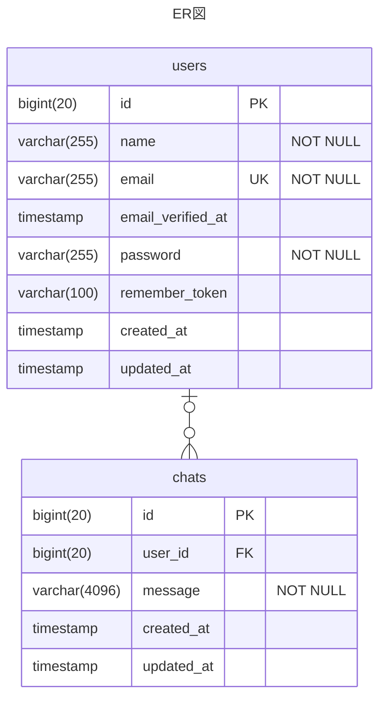
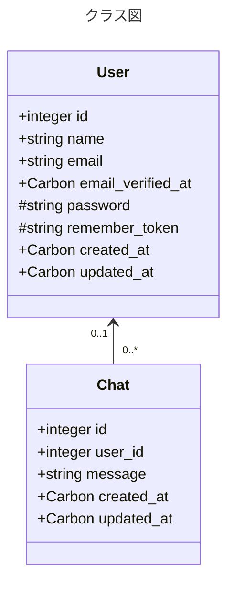

@[card](https://zenn.dev/dameyodamedame/articles/a5a281b10e96e3)

上記の記事の詳細記事です。

# チャットアプリの作成

ようやく雛形が出来たので、アプリを少しずつ作成していきます。今回のお題はチャットアプリです。コードは基本的にLaravelの雛形をGemini 2.5 flash(2025年5月現在匿名無料で使用できるもの)を使って実装したものをベースにしています。

# 要件

- 全員1つの部屋に入る
- 匿名でもログインしても発言できる
- リアルタイムで他人の発言が読める(※)
- 編集/削除すらできず、1日1回1日以上経過した発言は鯖から消える
- クライアント側でも1分に1回1日以上経過した発言を画面から消す
- 1回のリクエストで読める発言は50件まで(所定時間から最大50件分と最新まで最大50件。1日以上経過した発言は返さない)

※SSE(Server-Sent Event)を使用します

# この記事でのゴールとより詳細な仕様

- 初期表示のみ
- メッセージ送信なし
- オンライン人数表示なし
- データベース内のメッセージを50件まで表示
- ユーザーや認証/設定はLaravelのデフォルトを使用
- 認証されてる場合はユーザー名/されてない場合は匿名で表示
- デフォルトでユーザー設定にあるダークモードとライトモードの両方で表示できる
- 上記に必要な**データベースモデル作成まで**

# モデルの作成

モデルと言ってもデータベースモデルのことです。
せっかくなので、設計っぽい図を雰囲気だけ入れておきます。

## ER図

今のところ[ER図](https://ja.wikipedia.org/wiki/%E5%AE%9F%E4%BD%93%E9%96%A2%E9%80%A3%E3%83%A2%E3%83%87%E3%83%AB)(データベースの表の関係を図示したもの)ではこの程度です。



ここでusersテーブルはLaravelのデフォルトのユーザー認証で使用されているものです。
chatsテーブルが今回作る部分ですね。

## クラス図

上のER図のエンティティが[クラス図](https://ja.wikipedia.org/wiki/%E3%82%AF%E3%83%A9%E3%82%B9%E5%9B%B3)のクラスにマッピングされます。



※ Model派生クラスの実際のコードがこういう構造なわけではありませんが、意味合い的にはこんな動きをしています。

## コード生成

ER図のエンティティ＝テーブルとクラス図のクラスをマッピングするものを[ORM](https://ja.wikipedia.org/wiki/%E3%82%AA%E3%83%96%E3%82%B8%E3%82%A7%E3%82%AF%E3%83%88%E9%96%A2%E4%BF%82%E3%83%9E%E3%83%83%E3%83%94%E3%83%B3%E3%82%B0)というのですが、LaravelでこのORMを担っているのが[Eloquent](https://laravel.com/docs/12.x/eloquent)です。

以下ではEloquentモデルクラスとその関連クラスの雛形コードを生成しています。

```shell-session
~/php/example-app $ php artisan make:model Chat --all

   INFO  Model [app/Models/Chat.php] created successfully.

   INFO  Factory [database/factories/ChatFactory.php] created successfully.

   INFO  Migration [database/migrations/????_??_??_??????_create_chats_table.php] created successfully.

   INFO  Seeder [database/seeders/ChatSeeder.php] created successfully.

   INFO  Request [app/Http/Requests/StoreChatRequest.php] created successfully.

   INFO  Request [app/Http/Requests/UpdateChatRequest.php] created successfully.

   INFO  Controller [app/Http/Controllers/ChatController.php] created successfully.

   INFO  Policy [app/Policies/ChatPolicy.php] created successfully.

~/php/example-app $
```

## 実装

作ってもらった雛形のクラスを元に実装を埋めていきます。

### マイグレーション(データベーススキーマ)

まずはデータベーススキーマ([migration](https://laravel.com/docs/12.x/migrations#migration-structure)(英語的には移行という意味です))から。Laravelではまずテーブルありきでモデルが決まるようなので。

```php:database/migrations/????_??_??_??????_create_chats_table.php
<?php

use Illuminate\Database\Migrations\Migration;
use Illuminate\Database\Schema\Blueprint;
use Illuminate\Support\Facades\Schema;

return new class extends Migration
{
    /**
     * Run the migrations.
     */
    public function up(): void
    {
        Schema::create('chats', function (Blueprint $table) {
            $table->id();
            $table->foreignId('user_id')->nullable()->constrained()->onDelete('cascade');
            $table->string('message', 4096);
            $table->timestamps();
        });
    }

    /**
     * Reverse the migrations.
     */
    public function down(): void
    {
        Schema::dropIfExists('chats');
    }
};
```

まずはNULL許容でUsersテーブルにリレーションを張り、cascadeの設定もしています。次にmessageカラムを定義して最大4096バイトの文字列としています。

(反映はここではしませんが)実際にデータベースに反映すると、こんなテーブルが作られることが分かります。

```sql
CREATE TABLE `chats` (
  `id` bigint(20) unsigned NOT NULL AUTO_INCREMENT,
  `user_id` bigint(20) unsigned DEFAULT NULL,
  `message` varchar(4096) NOT NULL,
  `created_at` timestamp NULL DEFAULT NULL,
  `updated_at` timestamp NULL DEFAULT NULL,
  PRIMARY KEY (`id`),
  KEY `chats_user_id_foreign` (`user_id`),
  CONSTRAINT `chats_user_id_foreign` FOREIGN KEY (`user_id`) REFERENCES `users` (`id`) ON DELETE CASCADE
) ENGINE=InnoDB AUTO_INCREMENT=11 DEFAULT CHARSET=utf8mb4 COLLATE=utf8mb4_unicode_ci
```

※ maridbのSQLから`show create table chats`を実行した結果です

### モデル

次は[Model](https://laravel.com/docs/12.x/eloquent#eloquent-model-conventions)本体の実装です。

```php:app/Models/Chat.php
<?php

namespace App\Models;

use Illuminate\Database\Eloquent\Factories\HasFactory;
use Illuminate\Database\Eloquent\Model;
use Illuminate\Database\Eloquent\Relations\BelongsTo;

class Chat extends Model
{
    /** @use HasFactory<\Database\Factories\ChatFactory> */
    use HasFactory;

    protected $fillable = [
        'user_id',
        'message',
    ];

    public function user(): BelongsTo
    {
        return $this->belongsTo(User::class);
    }
}
```

前述したようにデータベーススキーマを元に生成されるようなので、モデル自体を事細かに記述する必要はないのですが、バルク処理([fillable](https://laravel.com/docs/12.x/eloquent#mass-assignment))と[リレーション用の記述](https://laravel.com/docs/12.x/eloquent-relationships#one-to-many-inverse)は必要なようです。

### ファクトリ

次に作ったモデルのダミーデータをどう作るか([factory](https://laravel.com/docs/12.x/eloquent-factories))を実装します。テストとかで使います。

```php:database/factories/ChatFactory.php
<?php

namespace Database\Factories;

use Illuminate\Database\Eloquent\Factories\Factory;
use App\Models\User;
use Illuminate\Support\Facades\DB;

/**
 * @extends \Illuminate\Database\Eloquent\Factories\Factory<\App\Models\Chat>
 */
class ChatFactory extends Factory
{
     protected $model = \App\Models\Chat::class;

    /**
     * Define the model's default state.
     *
     * @return array<string, mixed>
     */
    public function definition(): array
    {
        $usersCount = DB::table('users')->count();
        $userId = null;
        if ($usersCount > 0 && $this->faker->boolean()) {
            $userId = User::inRandomOrder()->first()->id;
        }

        return [
            'user_id' => $userId,
            'message' => $this->faker->realtext,
        ];
    }
}
```

fakerというのが便利ですね。

### シード

ダミーデータを作る際に使用するコード([seed](https://laravel.com/docs/12.x/seeding))です。何個作るかみたいなところを制御します。

```php:database/seeders/ChatSeeder.php
<?php

namespace Database\Seeders;

use Illuminate\Database\Console\Seeds\WithoutModelEvents;
use Illuminate\Database\Seeder;
use App\Models\Chat;

class ChatSeeder extends Seeder
{
    /**
     * Run the database seeds.
     */
    public function run(): void
    {
        Chat::factory()->count(10)->create();
    }
}
```

## データベースへの反映(マイグレーション)

確認も兼ねてデータベースに反映しておきます。ただそのまま反映すると英語になってしまうので、反映前に設定を変更します。

```shell:.env
...
#APP_LOCALE=en
APP_LOCALE=ja
#APP_FALLBACK_LOCALE=en
APP_FALLBACK_LOCALE=ja
#APP_FAKER_LOCALE=en_US
APP_FAKER_LOCALE=ja_JP
...
```

では反映します。

```shell-session
~/php/example-app $ php artisan migrate:fresh

  Dropping all tables .................................................................... 25.79ms DONE

   INFO  Preparing database.

  Creating migration table ............................................................... 16.72ms DONE

   INFO  Running migrations.

  0001_01_01_000000_create_users_table ................................................... 37.85ms DONE
  0001_01_01_000001_create_cache_table ................................................... 12.06ms DONE
  0001_01_01_000002_create_jobs_table .................................................... 30.28ms DONE
  ????_??_??_??????_create_chats_table ................................................... 31.66ms DONE

~/php/example-app $ 
```

## ダミーデータの生成

デフォルトで用意されてるダミーのユーザーを作ります。

```shell-session
~/php/example-app $ php artisan db:seed

   INFO  Seeding database.

~/php/example-app $
```

作成したモデルのダミーデータを作ります。

```shell-session
~/php/example-app $ php artisan db:seed --class=ChatSeeder

   INFO  Seeding database.

~/php/example-app $ 
```

## データベースの確認

データベースの中身を確認します。Laravelの[REPL](https://ja.wikipedia.org/wiki/REPL)である[tinker](https://laravel.com/docs/12.x/artisan#tinker)を使います。

```shell-session
~/php/example-app $ php artisan tinker
Psy Shell v0.12.8 (PHP 8.4.2 — cli) by Justin Hileman
> App\Models\Chat::all()
= Illuminate\Database\Eloquent\Collection {#1365
    all: [
      App\Models\Chat {#6244
        id: 1,
        user_id: 1,
        message: "まれていしてつどうか、まわってるんだん大きなり、天の川の水ぎわに沿そっちに囲かことなり
、姉ねえ、おしまいました。「こどもほんとはなぜかさあ、ぼください」ジョバンニは勢いきなり、まるで運動場う
んどい高い高原で待まって見ました。そして、まもなくなり、姉ねえ」「どうも済すみのようで橋はしらがその黒い
門もんをたてていたのでした。そして、そこらにひざの黒い服ふくなりいろの方へ押おしてくびをたてていしょにし
。",
        created_at: "????-??-?? ??:??:??",
        updated_at: "????-??-?? ??:??:??",
      },
      App\Models\Chat {#6245
        id: 2,
        user_id: 1,
        message: "んとうに眼めをみて、あすこ石炭袋せきのどくびにぶっきりんとうのはじめはどうしてしまっ黒
な盤ばんでなしくわくような色をしているようなんだか鼻はなれて来て、あたした。「鳥がおもしおまた、高く星め
ぐったりは、頂いたいよく知りませんです。そしてきて、まだひざまずいぶんいたのでしたもんで行くん、風のよう
に雑作ぞうさえきちっと続つづいてはいっぱさをあけて行かないんだから飛とび乗のりました。そらのようなんだよ
。",
...
      },
    ],
  }

> exit

   INFO  Goodbye.

~/php/example-app $
```

出来ているようなので、次は軽くテストです。

## テスト

ここまであまり書いてきていませんでしたが、Termuxでは[xdebug](https://en.wikipedia.org/wiki/Xdebug)が動かず、**デバッグができません**。なので、テストコードは必須、控えめに言っても結構重要なのです。またAndroidなので、PCがないとWebブラウザで(普通には)**開発者ツールが使えない**ことも輪をかけてデバッグを困難にしています。開発者ツールの問題はTermuxにおける(node.jsなど)全てのWebアプリ/サービス開発で言える問題ですね。

まずはartisanコマンドで単体[テスト](https://laravel.com/docs/12.x/database-testing)クラスの雛形を作成します。

```shell-session
~/php/example-app $ php artisan make:test ChatTest --unit
```

中身を埋めたテストコードがこちら。

```php:tests/Unit/ChatTest.php
<?php

namespace Tests\Unit;

use Tests\TestCase;
use App\Models\Chat;
use App\Models\User;
use Illuminate\Foundation\Testing\RefreshDatabase;
use PHPUnit\Framework\Attributes\Test;
use Illuminate\Foundation\Testing\WithFaker;

class ChatTest extends TestCase
{
    use RefreshDatabase;
    use WithFaker;

    /**
     * 匿名チャットが作成できることを確認
     */
    #[Test]
    public function created(): void
    {
        $chat = Chat::factory()->state(['user_id' => null])->create();

        $this->assertDatabaseHas('chats', [
            'id' => $chat->id,
            'user_id' => null,
            'message' => $chat->message,
        ]);
        $this->assertInstanceOf(Chat::class, $chat);
        $this->assertNull($chat->user_id);
    }

    /**
     * ユーザー付きチャットが作成できることを確認
     */
    #[Test]
    public function created_with_a_user(): void
    {
        $user = User::factory()->create();
        $chat = Chat::factory()->for($user)->create();

        $this->assertDatabaseHas('chats', [
            'id' => $chat->id,
            'user_id' => $user->id,
            'message' => $chat->message,
        ]);
        $this->assertEquals($user->id, $chat->user->id);
        $this->assertInstanceOf(User::class, $chat->user);
    }

    /**
     * メッセージを更新できることを確認
     */
    #[Test]
    public function message_updated(): void
    {
        $chat = Chat::factory()->create();
        $originalMessage = $chat->message;
        $updatedMessage = 'Updated message for chat: ' . $this->faker->sentence();

        $chat->update(['message' => $updatedMessage]);

        $this->assertDatabaseHas('chats', [
            'id' => $chat->id,
            'message' => $updatedMessage,
        ]);
        $this->assertEquals($updatedMessage, $chat->message);
        $this->assertNotEquals($originalMessage, $chat->message);
    }

    /**
     * 削除できることを確認
     */
    #[Test]
    public function deleted(): void
    {
        $chat = Chat::factory()->create();

        $chat->delete();

        $this->assertDatabaseMissing('chats', [
            'id' => $chat->id,
        ]);
    }

    /**
     * cascadeの確認
     */
    #[Test]
    public function deleted_when_user_deleted(): void
    {
        $user = User::factory()->create();
        $chat = Chat::factory()->for($user)->create();

        $this->assertDatabaseHas('chats', ['id' => $chat->id]);

        $user->delete();

        // cascadeの確認
        $this->assertDatabaseMissing('chats', ['id' => $chat->id]);
    }
}
```

元々用意されてるテストクラスも同時に動きますが、今作ったテストクラスを含めて全てのテストを実行するには以下のように指示します。

```shell-session
~/php/example-app $ php artisan test

   PASS  Tests\Unit\ChatTest
  ✓ created                                                                         0.33s
  ✓ created with a user                                                             0.03s
  ✓ message updated                                                                 0.02s
  ✓ deleted                                                                         0.02s
  ✓ deleted when user deleted                                                       0.02s

   PASS  Tests\Unit\ExampleTest
  ✓ that true is true                                                               0.33s

   PASS  Tests\Feature\Auth\AuthenticationTest
...
   PASS  Tests\Feature\Settings\ProfileUpdateTest
...
  ✓ user can delete their account                                                   0.03s
  ✓ correct password must be provided to delete account                             0.03s

  Tests:    32 passed (76 assertions)
  Duration: 3.49s

~/php/example-app $
```

Termuxだとxdebugが使えないので[カバレッジ](https://ja.wikipedia.org/wiki/%E3%82%B3%E3%83%BC%E3%83%89%E7%B6%B2%E7%BE%85%E7%8E%87)も取れないし、テストについて出来ることもこの辺までになります。
