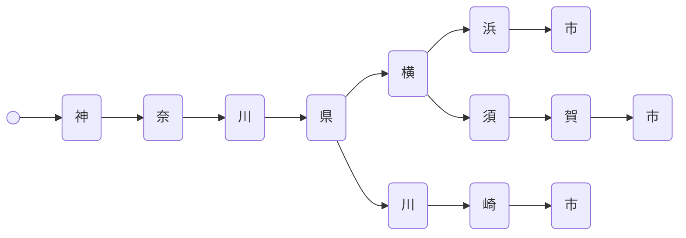
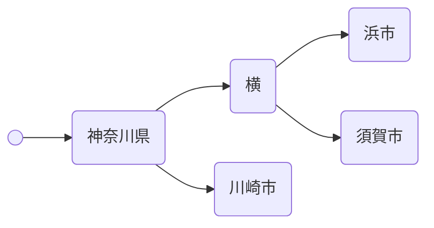
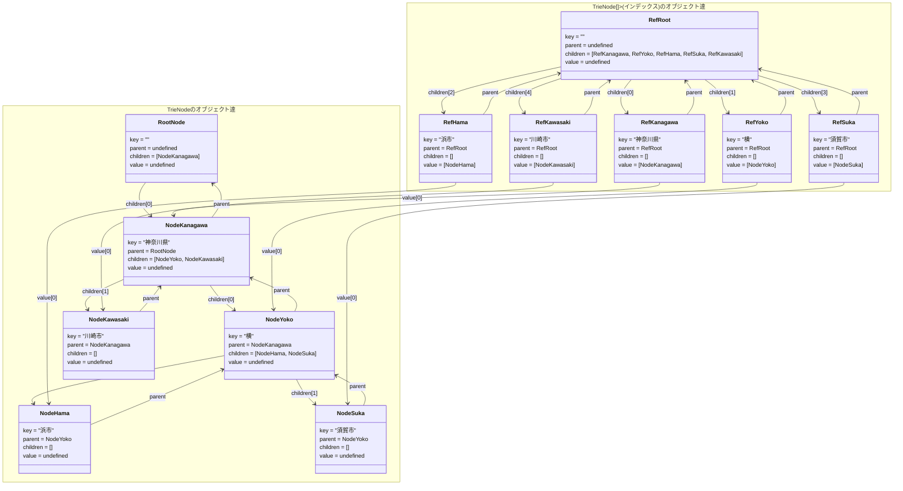

# 序

よく知られている日本郵便さん提供のCSVで、郵便番号と住所の一覧を載せているものがあります。

https://www.post.japanpost.jp/service/search/zipcode/download/

今回はこれ(UTF-8版)を使って「Webブラウザ上で住所から郵便番号を検索する」をなんとなくやってみました。
APIサーバーを使用しないので、ブラウザとその上で動くJavaScriptのみになり、ブラウザで用意されているストレージを使わないので、構築は毎回やる感じです。
見栄えはアレなんですが、こんな感じになっています。


ソースコードと動画のデモ画面は以下にあります。

ソースコード: https://github.com/marudedameo2019/postal-code-search-in-browser
デモ画面: https://marudedameo2019.github.io/postal-code-search-in-browser/

# 1. 目的

以下の条件で住所から郵便番号を引き当てること

- Webサーバーのみの静的Webサイト
- OPFS/ローカルストレージ/IndexedDBなどを使用しない
- 検索文字列の変更に対してリアクティブに検索結果が変わる

実装要件としては以下のとおりです。

- 原則TypeScript使用
- ReactみたいなReactiveフレームワーク使用**禁止**
- ES2025として出力(Iterator Helpers使用)
- esbuild使用(viteなど未使用)

なるべく特定の環境に依存しない形にしてます。

# 2. 背景

前回記事はストリーム処理についての記事([JavaScriptのメソッドチェインが遅い理由](https://zenn.dev/dameyodamedame/articles/0bd949354baf6e))だったので、何かそれなりの量のデータを処理するコード例を挙げたかったのです。実用的なデータで、ブラウザで扱える量だと`ken_all.csv`しかないな…と今回のテーマを選びました。

気になるところは、どういう方法を使ったときに現在のPCやスマホでどれくらいの時間がかかるのか、インクリメンタルサーチに使える方式の目安が分かればいいかなと思った次第です。

対象読者は以下の方です。

- JavaScript/TypeScriptを読める人
- Trie木をよく知らない人

# 3. 要件と設計の選択

目的のところで書いた条件だと、最終的にはTrie木かB木を事前に作っておいてdownloadして検索する感じかな…と思うのですが、今回は以下の5種類を試してみました。

|番号|名前|検索方式|構築方法|
|:---:|:---|:---|:---|
|1|直接部分一致検索|fgrep|csv読み込みのみ|
|2|トライ木先頭一致検索|圧縮Trie木|画面を開いたときにcsvから構築|
|3|静的トライ木先頭一致検索|圧縮Trie木|バイナリデータをデシリアライズして構築|
|4|二重トライ木部分一致検索|圧縮Trie木 x 2|画面を開いたときにcsvから構築|
|5|静的二重トライ木部分一致検索|圧縮Trie木 x 2|バイナリデータをデシリアライズして構築|

B木がないのは全文検索が面倒だったからです。B木をやるならOPFSのSQLiteでやってみかったのですが、ちょっと説明のボリュームが増えすぎそうだったのと、計測したら思ったよりfgrepが速かったのでB木の魅力が相対的に小さくなってやめたという感じです。

2と3、4と5は内容的には同じ方式なのですが、構築方法が異なり構築にかかる時間が違います。細かく言えば内部データ形式も違っていて、静的な方がよりコンパクトになっているので、検索時間もやや違う可能性があります。

1,2,4の検索結果の違いが分かる動画を入れておきます。


ここから少し用語の説明をしておきます。

## 3-1. fgrepとは

U〇ixライクなOSでは定番の`grep`([wikipediaの説明](https://ja.wikipedia.org/wiki/Grep))というコマンドをご存じでしょうか？

指定したテキストファイルに引数で指定した文字列があったらその行を表示させるコマンドです。結構高機能で正規表現なども使用できるのですが、`fgrep`というコマンド(中身はシェルスクリプトで実質`grep -F`なエイリアス相当)を使うと、正規表現のような高度なマッチング処理を行わず、単純な文字列検索のみを使用した検索になります。

つまり`fgrep`方式とは、

```ts:hoge.ts
const getFgrep = (s: string) => (line: string) => line.indexOf(s) >= 0; // 単純な文字列検索
const lines = ['application', 'apple', 'append'];
const searches = ['app', 'appl', 'e'];
searches.forEach(s => {
    console.log(`Search for \"${s}\"...`);
    console.log(lines.filter(getFgrep(s)));
});
```

こんな感じのコードで表現できるような検索で、これを実行するとこんな感じになります。

```sh
$ npx tsx hoge.ts
Search for "app"...
[ 'application', 'apple', 'append' ]
Search for "appl"...
[ 'application', 'apple' ]
Search for "e"...
[ 'apple', 'append' ]
```

## 3-2. Trie木とは

[wikipediaの説明はコレ](https://ja.wikipedia.org/wiki/%E3%83%88%E3%83%A9%E3%82%A4_(%E3%83%87%E3%83%BC%E3%82%BF%E6%A7%8B%E9%80%A0))です。日本語の自然言語処理では昔からよく使われてきたデータ構造です。基本は`Map<string, T>`のように文字列から何かの値を取得するために使われる構造で、図にするとこんな感じになります。



1ノード1文字で、最初のノードから順番に辿り、次の文字が何かによって分岐があり、文字列の終端には値があるという感じですね。今回の図では書ききれずに値が書かれていませんが、まあ分かるでしょう。1文字ずつ辿るだけなので、分岐が少ないと特に単純で高速です。

そして、分岐のない部分をまとめて文字列にしてさらに効率的にしたのが圧縮Trie木(パトリシア木)です。



このTrie木は、住所などのように同じ文字列が何度も続く木構造を表すのに向いてます。先頭から一致する文字を辿るのは得意ですが、部分一致する文字列は得意というほどではありません。

## 3-3. 静的Trie木とは

Nodeの追加や値の追加をしないことにし、メモリ効率などを上げた形を指しています。特に表しているものは変わりません。

# 4. デモの動かし方

## 4-1. ビルド

```sh
$ git clone https://github.com/marudedameo2019/postal-code-search-in-browser.git
$ cd postal-code-search-in-browser.git
$ npm i
$ npm run build
$ npm run generate
```

## 4-2. 静的Webサーバーの起動

`npx serve .`とか`npx http-server`とか`python3 -m http.server`とかで起動して、URLを叩けば開きます。
serveを使用すると、crossOriginIsolatedをtrueに出来ます。

# 5. デモ画面の説明

## 5-1. 検索方法

5種類選択できます。概要は要件と設計の選択で説明したとおりです。

### 5-1-1. 直接部分一致検索

検索結果が一番分かりやすい検索方法です。なんでコレが検索されないんだろうと思うことがありません。
CSVファイルに書かれた順に検索していき、上限(30件)で止まる仕様です。
うちのPCだと数ms、うちのスマホでも20～30msくらいで検索出来るようなので、インクリメンタルサーチは十分可能ではないかと思います。
ただ、検索結果は素朴であり、30件の中に希望の分岐が含まれるかどうかは微妙かもしれません。

特性上は、沢山引っ掛かるものほど上限に達しやすく速くなり、件数が少ないものほど全件探索になって遅くなります。
今回は画面ロード時にCSVをパースしているので、うちのPCで200msほど、うちのスマホだと~~2～3秒~~500ms(csv-pipeに変えて通信が圧縮されるようになった)ほどかかりました。~~19MB程度あるので、通信なのか解析なのかそれなりに時間がかかるようです~~。~~実用上はCSVでないデータ形式からロードする形にすべきでしょうね~~。brotliによる事前圧縮(19MB→1.5MB)が行われており、firefox/safariではそちらが使われるはずです。chromeはjsからbrotliによる伸長が出来ないので、従来通り19MBのCSVを読み込みますが、Webサーバーによっては通信が圧縮されることが多いです。

### 5-1-2. トライ木先頭一致検索

検索はすこぶる低コストで速く、検索結果も素直で分かりやすいのですが、都道府県から入力しないと1件もヒットしないのが玉に瑕で、機能的に**致命的な欠陥**です。ただ部分文字列検索と違い、次のノードを候補として表示することが出来るので、インクリメンタルサーチには機能的に有効な方式ではあると思います。

特性上はとにかく低コスト、低機能という感じです。Trie木構築の時間もスマホで200ms程度なので、低コストです。もちろんCSV読み込み時間(~~2～3秒~~500ms)は別途かかります。

### 5-1-3. 静的トライ木先頭一致検索

トライ木先頭一致検索と同様です。
構築時間はダウンロード込みで300ms程度(二重トライ木用データ含む)なので、構築コストの問題は解消できています。

### 5-1-4. 二重トライ木部分一致検索

圧縮トライ木のノードに対して、インデックスを張ったものです。インデックスには同じく圧縮トライ木を使っています。

例えば「神奈川県横浜市…」という住所なら、本来神奈川県から入力しないと検索できないのですが、これを横浜市から検索できるようにする、という意味です。圧縮Trie木のノードに対するインデックスなので、検索可能な位置は、圧縮Trie木の分岐点だけになります。つまり「川県横」で検索しても、「神奈川県-横-浜市」という感じの分岐点なのでヒットしないということです。これは**ユーザーにとっては明確な問題点**であり、検索結果が分かりにくいと言われるとぐうの音も出ません。

また「横浜市」で検索すれば検索できるのですが、実際に検索するノードは「横」になるので、全国各地にある「横」というノードが全て検索対象になってしまい、それなりにコストがかかります(実際には「横浜」というノードも、「横浜市」というノードも検索します)。それらが出現する全てのノードを起点に検索して、最長一致する文字列のみを残す形になるのがこの検索方式です。つまり1回の検索で、トライ木先頭一致検索を数100回分とか実施したりするということです。最長一致を探す都合から件数で端折ることも出来ず、愚直に検索することになります。

特性としては、短く検索しても長く検索しても起点の数分検索するので、それなりに時間がかかります。起点の数が少ない、つまり珍しい地名ほど起点の出現回数が少ないので、高速に検索できます。数100回検索することになっても、およそfgrep方式よりは高速で、大体10倍程度は速いかなと思っています。ただ特性が真逆に近いので、比較はやや難しい感じです。

なお、インデックスはTrie構造を線形探索するのみ(二分探索は可能な形だけどしていない)なので、最初から分岐が2000ノード以上だし、二分探索をすることで多少高速化できるかもしれません。

インデックス構築性能はかなり遅く、スマホだと4秒程度かかっています。

### 5-1-5. 静的二重トライ木部分一致検索

二重トライ木部分一致検索とほぼ同じです。最初のTrie構造構築がダウンロード込み、スマホで300ms程度で済む点だけが主な違いです。

もちろん機能・性能的な話で、実装レベルではかなり違います。

## 5-2. 住所入力テキストボックス

ここに住所を入力することで、下のメッセージ表示部分に候補がリアクティブに反映されます。日本語変換中の文字列もそのままイベント発火されて使用されるので、注意が必要です。将来的には読み仮名での検索も出来るようにすると少し楽かもしれません。製品機能で言えば、表記揺れに対応するため入力正規化が必要なのですが、今回はデモなのでその手の実装はありません。

右にある「全タブ同期」というチェックボックスを押下すると(同じURL内のタブで)このチェックが入った全タブの住所入力テキストボックスが同期されます。

## 5-3. 検索時間測定ボタン

このボタンを押すと、裏で住所からランダムで1000個分の部分文字列を生成し、各検索方式で検索し、検索結果の個数を算出して捨ててます。一切表示されません。
先頭一致検索はかなり高速に終わるのですが、恐らくほとんど検索ヒットしてないので、計測そのものをしていません。
計測が終わると下のメッセージ領域の「ランダム～時間」とか書いてるところに結果が表示されてます。

## 5-4. メッセージ表示領域

|項目|説明|
|:---|:---|
|[crossOriginIsolated](https://developer.mozilla.org/ja/docs/Web/API/Window/crossOriginIsolated)|corsとかの仲間で、このオリジンが分離されてる(安全な状態)ときにtrueになり、時間計測時の精度が上がります。|
|CSV読み込み時間|CSVをダウンロードして~~PapaParse~~csv-pipeでパースし行データの配列として格納するまでの時間です|
|Trie構築時間|行データの配列からTrie木構造を構築するのにかかる時間です。構築されたTrie木構造はトライ木先頭一致検索と二重トライ木部分一致検索で使います。|
|Trieインデックス構築時間|上で構築したTrie木構造へのインデックスを別のTrie木データで構築するのにかかった時間です。二重トライ木部分一致検索で使います。|
|静的検索用データ読込時間|バイナリデータから静的Trie木データを2つ復元するのにかかった時間です。静的トライ木先頭一致検索と静的二重トライ木部分一致検索で使います。|
|検索時間|住所入力テキストボックス入力時、リアクティブに行われる検索にかかった時間です。|
|ランダム部分住所検索1000回時間(直接部分一致検索)|検索時間測定ボタン押下時、直接部分一致検索にかかった時間です。|
|ランダム部分住所検索1000回時間(二重トライ木部分一致検索)|検索時間測定ボタン押下時、二重トライ木部分一致検索にかかった時間です。|
|ランダム部分住所検索1000回時間(静的二重トライ木部分一致検索)|検索時間測定ボタン押下時、静的二重トライ木部分一致検索にかかった時間です。|
|検索住所文字列|住所入力テキストボックスの内容です。日本語変換中もリアクティブに検索されるので、検索文字列を明確にするために書いています。|
|検索結果(最大N件)|最大N件の検索結果です。|

## 5-5. トライ木の図示

CSV→行データの配列→Trie木構造で構築したデータをd3.jsでSVGとして図示しています。ノードをクリックすると、左クリック/タップするとその先のノードが展開され、微妙に座標が変わります。迷子になったらその場でマウスを再度クリックし、僅かに移動すると元のクリックしたノード付近に移動できます。左クリックしながらマウス移動でスクロールでき、マウスホイールで拡縮できます。正直UIがアレなんですが、表示はやっつけなので、気にしていません。スマホでは特に使いにくいのでスマホで見るのはオススメしません。

## 5-6. 参照トライ木の図示

参照トライ木(インデックス用のトライ木)をd3.jsでSVGとして図示しています。操作方法などは「トライ木の図示」と同じなのですが、最初から2000ノード以上表示されており、ブラウザによってはPCでも固まります。PCのfirefox以外での閲覧をオススメしません。

# 6. ファイル構成

```text
.
├── dist                <-- buildした結果が配置される場所
├── external
│   └── utf_ken_all.csv <-- 日本郵便さんが配布してるCSV
├── index.html          <-- デモ画面のhtml
├── package-lock.json
├── package.json
├── scripts
│   └── build.mjs       <-- esbuildのビルドスクリプト
├── serve.json          <-- serve用の設定ファイル
├── src
│   ├── *.ts            <-- ソースファイル
│   ├── *.test.ts       <-- node::test用の単体テストソースファイル
└── tsconfig.json
```

## 6-1. ソースファイル一覧

|ファイル名|説明|
|:---|:---|
|index.ts|index.htmlから読まれる唯一の起点となるファイル|
|read_csv.ts|CSVファイルを読み込むコード|
|table.ts|CSVファイルを読んで格納する行データの構造|
|trie.ts|追加が可能な圧縮Trie木を操作するコード|
|for_each_Indef_of.ts|CSVから読み込んだデータfgrep方式で検索するコード|
|search_trie_root.ts|CSVから構築された圧縮Trie木を先頭一致で検索するコード|
|search_trie_substr.ts|CSVから構築された圧縮Trie木x2を部分一致で検索するコード|
|static_conv.ts|圧縮Trie木x2を静的構造に変換するコード|
|static_trie.ts|変換用に静的Trie構造を記述したコード|
|static_common.ts|静的Trie構造を扱う共通基礎コード/データ|
|search_trie_root.ts|静的Trie構造を先頭一致で検索するコード|
|search_trie_substr.ts|静的Trie構造を部分一致で検索するコード|
|gen_data.ts|CSVから構築されたTrie構造を静的Trie構造に変換してデータファイル出力するコード|
|d3_trie_view.ts|圧縮Trie木を可視化用d3.js使用コード|
|measure.ts|時間測定用コード|
|brotli.ts|brotli伸長のランタイムでの対応判定コード|

## 6-2. 依存パッケージ

**バンドルしてるもの**

- ~~PapaParse~~csv-pipe: CSVパース用に使用。ブラウザ/node.jsで使えるCSVパーサー(papaparseだとキャッシュも圧縮もされないので変えた)
- d3.js: SVGを使用したグラフ描画ツール。圧縮Trie木の可視化に使用。

**開発中に使用していたもの**

- typescript: TypeScriptコンパイラ。エラーチェック用。
- tsx: TypeScriptの直実行用
- esbuild: ビルドに使用

**npxから直に一時使用してたもの(好きなの使ってほしいのでインストールしてない)**

- serve: Vercel製静的webサーバー(crossOriginIsolated用)
- http-server: 静的webサーバー

# 7. 詳細

詳細は原則実装参照です。以下は形ばかり用意した図になります。

## 7-1. TrieNodeによるTrie木の関係図示

クラス図で書いていますが、オブジェクト図です。



## 7-2. 射影された静的構造でのTrie木表現の図示

静的構造に含まれるTrie木がどんなデータ構造になっているかを表した図です。上の`TrieNode<number>`側が静的構造だとこうなります。


refTrieは似たような構造なのでこちらが分かれば分かると思います。

# 8. まとめ

- Trie木を使った住所→郵便番号検索を実装できた
- fgrep方式でも数10msオーダーで検索できた
- fgrep方式よりTrieを使った方式の方が一桁くらい速い